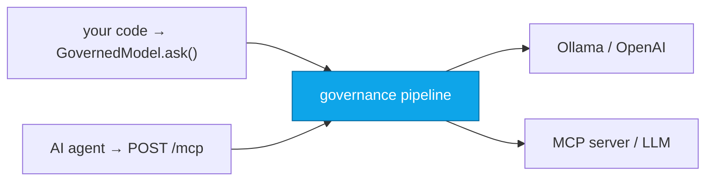

<!--
<p align="center">
  
</p>
-->

<p align="center">
  <strong>Install once, get governed AI.</strong><br>
  <em>PII redacted · Injections blocked · Loops broken · Actions audited · EU AI Act tracked</em>
</p>

<p align="center">
  <a href="https://pypi.org/project/admina-framework/"></a>
  &nbsp;<a href="https://github.com/admina-org/admina/blob/main/LICENSE"></a>
  &nbsp;
  &nbsp;
</p>

<p align="center">
  <a href="https://github.com/admina-org/admina/actions/workflows/ci.yml"></a>
  &nbsp;<a href="https://github.com/admina-org/admina/actions/workflows/release.yml"></a>
  &nbsp;<a href="https://github.com/admina-org/admina/actions/workflows/security.yml"></a>
  &nbsp;<a href="https://pypi.org/project/admina-framework/"></a>
</p>

<p align="center">
  <a href="https://deepwiki.com/admina-org/admina"></a>
  &nbsp;<a href="https://admina.org/docs"></a>
</p>

<p align="center">
  <a href="#quick-start"></a>
  &nbsp;<a href="#see-it-in-action"></a>
  &nbsp;<a href="https://admina.org/docs"></a>
  &nbsp;<a href="https://deepwiki.com/admina-org/admina"></a>
</p>

---

## See it in action

**Scaffold a project and boot the governed proxy + dashboard — no Docker:**

<p align="center">
  
</p>

**Wrap any model in a few lines — PII is stripped before the model ever sees it:**

<p align="center">
  
</p>

**The governance dashboard, before and after simulated traffic — Admina Score 40 → 60:**

<table>
  <tr>
    <td align="center" width="50%">
      <br>
      <em>First boot — Admina Score <strong>40/100</strong></em>
    </td>
    <td align="center" width="50%">
      <br>
      <em>After <code>python scripts/simulate.py</code> — <strong>60/100</strong></em>
    </td>
  </tr>
</table>

---

## Why Admina?

|                                | Plain LLM / RAG app                  | **With Admina**                                                          |
| :----------------------------- | :----------------------------------- | :----------------------------------------------------------------------- |
| PII in prompts/responses       | leaks unless you build redaction     | **Redacted by default** — email, SSN, IBAN, phone, IP, names             |
| Prompt injections              | reach the model                      | **Blocked at the proxy** — 15 regex + Rust heuristic scoring             |
| Agent tool calls               | unaudited                            | **Validated pre-action + logged post-action** (forensic chain)           |
| Loop / runaway agents          | burn tokens / budget                 | **Broken** — TF-IDF cosine similarity over the action stream             |
| EU AI Act readiness            | manual                               | **Gap analysis + risk classification** built-in                          |
| Audit trail                    | logs you hope nobody deletes         | **SHA-256 hash chain** — tamper-evident by design                        |
| Adding governance to existing code | rewrite the call sites           | **Zero code changes** via proxy, or 3 lines via SDK                      |
| Performance overhead           | unknown                              | **~6 µs per pipeline** (Rust engine), in-process or networked            |
| License                        | varies                               | **Apache 2.0**, open core                                                |

> Admina is **decision-support and defense-in-depth**, not legal advice. See [Compliance scope](#compliance-scope) for the full disclaimer and limitations.

---

## 30-second example

```python
from admina import GovernedModel, GovernedData, GovernedAgent, ComplianceKit
from admina.plugins.builtin.adapters.ollama import OllamaAdapter
from admina.plugins.builtin.connectors.chromadb import ChromaDBConnector

# Every call is governed: PII redacted, injections blocked, audited
adapter = OllamaAdapter(host="http://localhost:11434")
model = GovernedModel(model_name="llama3.1:8b", adapter=adapter)
response = await model.ask("Summarize this document")

# Data governance: residency enforcement, PII classification
connector = ChromaDBConnector(host="localhost", port=8000)
data = GovernedData(connector=connector, residency_zone="eu")
await data.ingest(documents)

# Agent governance: validate every tool call before execution
async def my_upstream(method, params, **kw): ...  # your MCP/HTTP client
agent = GovernedAgent(upstream=my_upstream)
result = await agent.call("tools/call", {"name": "read_file", "arguments": {}})

# Compliance: EU AI Act gap analysis and risk classification
kit = ComplianceKit()
report = kit.gap_analysis(risk_category="high", current_compliance={...})
```

## Quick Start

### Install from PyPI

```bash
# Recommended for new users: SDK + proxy + dashboard.
# Lets you run `admina dev` and see the dashboard out of the box.
pip install "admina-framework[proxy]"

# Everything (proxy + NLP + telemetry). Use this if you also want
# spaCy-based NER for PII detection or OpenTelemetry export.
pip install "admina-framework[full]"
python -m spacy download en_core_web_sm   # for [full] only

# Optional: Rust-accelerated engine (auto-detected at runtime).
# Opt-in extra — pulls in the admina-core wheel from PyPI.
pip install "admina-framework[rust]"

# Advanced: SDK only (no proxy, no dashboard, no `admina dev`).
# Use this when embedding the SDK into another service and you don't
# need the local dev server.
pip install admina-framework
```

> The PyPI distribution name is `admina-framework`; the Python import
> name is `admina` (e.g. `from admina import GovernedModel`). This is
> a normal Python pattern — same as `python-dateutil` → `import dateutil`.

> The Rust engine is an **optional, opt-in** accelerator. The default
> `pip install admina-framework` ships only the pure-Python implementation;
> `admina-framework[rust]` adds the `admina-core` wheel, which Admina
> auto-detects at runtime (falling back to pure Python if it's absent).
>
> The default is pure Python on purpose: the Python injection firewall
> currently has **broader detection coverage** than the Rust one (it adds
> obfuscation-normalisation — homoglyph, leetspeak, base64, ROT13 — and a
> wider multilingual pattern set). Enable `[rust]` when per-request latency
> matters more than that extra coverage. See
> [Performance](#performance--hybrid-python--rust-engine) for the trade-off.

### Or install from source

```bash
git clone https://github.com/admina-org/admina.git
cd admina

# Recommended: proxy + dashboard + infra deps (enables `admina dev`)
pip install -e ".[proxy]"

# Everything (proxy + NLP + telemetry)
pip install -e ".[full]"

# CLI workflow
admina init my-project   # Scaffold a governed AI project
cd my-project            # admina dev runs from the project directory
admina dev               # Start the local proxy + dashboard

# Full stack via Docker (no [proxy] extra required)
./scripts/bootstrap-secrets.sh   # Auto-generate .env with random credentials
docker compose up --build        # Credentials printed at bootstrap

# Note: To use the OllamaAdapter, install Ollama (https://ollama.ai)
# and pull a model first: ollama pull llama3.1:8b

# Advanced: SDK only (no proxy, no dashboard)
pip install -e .
python -c "from admina import GovernedModel; print('SDK ready')"
```

Dashboard: [http://localhost:3000](http://localhost:3000) | API docs: [http://localhost:8080/docs](http://localhost:8080/docs)

## Architecture

Admina runs in **dual mode** — in-process via SDK or networked via proxy — but both modes feed the **same governance pipeline**.



Pipeline (identical in both modes): `PII redaction → firewall → loop-breaker → audit → forensic chain (SHA-256) → OTEL`

## The 4 Governance Domains

| Domain | Capabilities | Engine |
|--------|-------------|--------|
| **Agent Security** | Anti-injection firewall (15 regex + heuristic scoring), loop breaker (TF-IDF cosine similarity) | Rust + Python |
| **Data Sovereignty** | PII redaction (email, SSN, credit cards, IBAN, phone, IP), residency enforcement, data classification | Rust + spaCy NER |
| **Compliance** | EU AI Act risk classification (Art. 6) and gap analysis (Art. 9-15), forensic black box (SHA-256 hash chain), OTEL native spans | Rust + Python |
| **AI Infrastructure** | LLM engine (Ollama, OpenAI), RAG pipeline (ChromaDB), Open WebUI | Python |

All governance domains operate **bidirectionally** — scanning both outbound requests and inbound responses.

## SDK

Four governed primitives, each with async + sync interfaces:

```python
from admina import GovernedModel, GovernedData, GovernedAgent, ComplianceKit
```

| Primitive | Purpose | Governance applied |
|-----------|---------|-------------------|
| `GovernedModel` | LLM calls (Ollama, OpenAI) | PII redaction on prompts and responses, event audit |
| `GovernedData` | Data ingestion and queries | PII classification, residency enforcement, access audit |
| `GovernedAgent` | MCP/A2A agent calls | Firewall, PII, loop breaker — full proxy pipeline in-process |
| `ComplianceKit` | Regulatory compliance | EU AI Act risk classification, gap analysis, report generation |

## Plugin System

9 plugin interfaces, auto-discovered from `plugins/builtin/` or installed via CLI:

| Interface | Builtin implementations |
|-----------|------------------------|
| Model Adapter | Ollama, OpenAI |
| Data Connector | ChromaDB, Filesystem |
| Governance Domain | GuardrailsAI (toxic, jailbreak, bias, PII) |
| Compliance Template | EU AI Act |
| Transport Adapter | MCP, HTTP REST |
| Forensic Store | Filesystem, S3-compatible (boto3), MinIO (legacy) |
| Auth Provider | API Key |
| PII Engine | spaCy + Regex |
| Alert Channel | Log, Webhook |

```bash
admina plugin list                    # List registered plugins
admina plugin install ./my-plugin     # Install a custom plugin
admina plugin create my-domain        # Scaffold a new plugin
```

## CLI

```bash
admina init my-project     # Scaffold project with admina.yaml + docker-compose.yml
admina dev                 # Local mode: proxy + dashboard on :3000 (no Docker)
admina dev --stack         # Docker stack: + redis + clickhouse + minio + grafana
admina dev --with-llm      # --stack + ollama + chromadb + open-webui
admina plugin list         # List all registered plugins
admina plugin install X    # Install a plugin from path or registry
admina plugin create X     # Scaffold a new plugin from template
```

`admina dev` defaults to a **single-process local mode** with zero Docker
dependency: one uvicorn serves the proxy API and the dashboard SPA on the
same port. Use `--stack` for the production-like Docker compose, or
`--with-llm` to also boot local LLM services.

## Dashboard

Real-time governance dashboard on port 3000:

- **Governance Score** — 0-100 composite metric (data residency, audit coverage, attack rate, forensic integrity, EU AI Act compliance)
- **Live Feed** — streaming governance events via WebSocket
- **Compliance Gaps** — EU AI Act gap analysis with article-level detail
- **Infrastructure Health** — proxy, Redis, MinIO, ClickHouse, OTEL status

API backend: `GET /api/dashboard/score`, `/feed`, `/compliance`, `/sovereignty`, `/infra`, `/models`

## Configuration

Admina uses `admina.yaml` as the primary config file (with `.env` fallback for backward compatibility):

```bash
cp admina.yaml.example admina.yaml   # Copy and customize
```

See [`admina.yaml.example`](https://github.com/admina-org/admina/blob/main/admina.yaml.example) for all options including domains, AI infra, plugins, dashboard, forensic storage, alert channels, and integrations.

<a id="compliance-scope"></a>

<details open>
<summary><strong>⚖️ Compliance scope &amp; legal disclaimer</strong> — what Admina does and does not do legally</summary>

<br>

> Admina is a self-assessment and defense-in-depth tool. The EU AI Act
> gap-analysis and risk classification features are **decision-support
> aids, not legal advice**. They do not replace the conformity assessment
> required under EU AI Act Art. 43 for high-risk systems, nor the
> involvement of a notified body where the regulation requires one.
>
> **EU AI Act timeline (after the Omnibus VII agreement of 7 May 2026):**
> Art. 5 prohibitions in force since 2 February 2025; GPAI obligations
> in force since 2 August 2025; Art. 50 transparency for synthetic
> content and the new NCII / synthetic-CSAM prohibition apply from
> 2 December 2026; **Annex III high-risk obligations from 2 December
> 2027** (postponed from 2 Aug 2026); Annex I high-risk from 2 August
> 2028 (postponed from 2 Aug 2027). The full machine-readable timeline
> ships with Admina as `admina.domains.compliance.eu_ai_act.EU_AI_ACT_DEADLINES`.
> See [`MODEL_CARD.md`](https://github.com/admina-org/admina/blob/main/MODEL_CARD.md) for the full scope, limitations,
> and known failure modes of every Admina component.

</details>

## Integrations

<details>
<summary><strong>GuardrailsAI</strong> — ML-based content validation as a governance plugin</summary>

<br>

ML-based content validation (toxic language, jailbreak, bias, PII via Presidio) as a governance domain plugin:

```bash
# Upstream guardrails-ai is currently in PyPI quarantine. Install it
# manually from your local mirror or wheel cache; once available, the
# plugin in admina/plugins/builtin/guards/guardrailsai_guard.py will
# detect it automatically.
pip install <your-guardrails-ai-wheel>
```

Enable in `admina.yaml` under `agent_security.domains.guardrailsai`. All inference runs locally by default — no data leaves the deployment perimeter.

</details>

<details>
<summary><strong>OpenClaw</strong> — govern OpenClaw agent actions via pre/post-action hooks</summary>

<br>

Govern OpenClaw agent actions through the Admina proxy. Every tool call, shell command, and API request is validated before execution:

```bash
cd integrations/openclaw/admina-governance
chmod +x setup.sh && ./setup.sh
```

The skill uses `POST /api/v1/validate` (pre-action) and `POST /api/v1/audit` (post-action) endpoints.

</details>

<details>
<summary><strong>n8n</strong> — community nodes for n8n workflow automation</summary>

<br>

| Node | Purpose |
|------|---------|
| **Admina Govern** | Inline governance check — validates workflow data, blocks injections, redacts PII |
| **Admina Audit** | Logs workflow events to forensic black box with EU AI Act risk classification |
| **Admina Dashboard** | Trigger node — fires on governance events via WebSocket |

Install: `npm install n8n-nodes-admina` in your n8n instance.

</details>

<details>
<summary><strong>Cheshire Cat AI</strong> — govern all Cheshire Cat interactions via Python hooks</summary>

<br>

Three Python hooks (`agent_fast_reply`, `before_cat_sends_message`, `before_cat_recalls_memories`):

```bash
cd integrations/cheshirecat/admina-plugin
./setup.sh    # Start Admina sidecar
# Copy plugin into Cheshire Cat plugins/ directory
```

</details>

<details>
<summary><strong>LangChain</strong> — drop-in callback handler</summary>

<br>

Governs every LLM call and tool invocation in-process:

```python
from admina.integrations.langchain.callbacks import AdminaCallbackHandler

handler = AdminaCallbackHandler()
llm = ChatOpenAI(callbacks=[handler])
```

</details>

<details>
<summary><strong>CrewAI</strong> — step and task callbacks for multi-agent governance</summary>

<br>

```python
from admina.integrations.crewai.callbacks import admina_step_callback, admina_task_callback

agent = Agent(role="Researcher", step_callback=admina_step_callback)
crew = Crew(agents=[agent], tasks=[task], task_callback=admina_task_callback)
```

</details>

See [full integration docs](https://github.com/admina-org/admina/blob/main/docs/guides/integrations.md) for details.

## Performance — Hybrid Python + Rust engine

The Rust core engine is an optional accelerator. The default
`pip install admina-framework` ships only the pure-Python implementation;
enable the Rust engine with the opt-in extra `pip install
"admina-framework[rust]"` (or build from source for local development —
`maturin develop --release --manifest-path core-rust/Cargo.toml`, see
[CONTRIBUTING.md](https://github.com/admina-org/admina/blob/main/CONTRIBUTING.md)). At runtime Admina auto-detects
whichever is available and falls back transparently to Python if the Rust
extension is not installed.

> **Detection trade-off (why Rust is opt-in, not the default).** The Rust
> firewall is faster but currently detects a narrower set of attacks than
> the pure-Python firewall. The Python engine normalises common evasions
> before matching (homoglyph, leetspeak, char-by-char hyphenation, base64,
> ROT13) and carries a wider multilingual pattern set; the Rust engine does
> not yet. On an internal 14-attack evasion corpus the Python firewall
> blocks all 14 while the Rust firewall blocks 7 (the plain-text and
> multilingual-keyword attacks), with no false positives on either side.
> Full Rust↔Python detection parity is tracked for 0.10. Until then, keep
> the default (pure Python) when detection breadth matters; opt into
> `[rust]` when latency dominates.

Measured numbers below assume the Rust engine is loaded:

```
Component          Rust (median)   P95        P99
-----------------  -------------   ---------  ---------
Firewall (regex)   2.08us          2.33us     2.50us
PII Scanner        0.62us          0.67us     0.71us
Loop Breaker       2.38us          2.67us     2.75us
Hash Chain         1.00us          1.12us     1.25us
-----------------  -------------   ---------  ---------
4-Domain pipeline  6.25us          7.04us     7.29us
```

<details>
<summary>Rust vs Python comparison (click to expand)</summary>

```
Component          Python (median)   Rust (median)   Speedup
-----------------  ---------------   -------------   --------
Firewall           7.79us            2.08us          3.7x
PII (regex-only)   8.21us            0.62us          13.2x
PII (with spaCy)   1 992us           0.62us          3 213x
Loop (sklearn)     505us             2.38us          212x
-----------------  ---------------   -------------   --------
Full pipeline      2 261us           5.21us          434x
```

</details>

## Traffic Simulator

Generate realistic governance traffic to test and demo the platform:

```bash
# Start the proxy
docker compose up -d

# Default: 60s at 2 req/s
python scripts/simulate.py

# Intense: 5 minutes at 10 req/s
python scripts/simulate.py --duration 300 --rate 10
```

Generates a weighted mix of: clean MCP requests, injection attempts, PII content, loop triggers, REST validate/audit calls, EU AI Act classifications, and dashboard reads. Colored terminal output with per-event action and summary counters.

## Infrastructure & Services

The full stack (`docker compose up`) runs 9 containers:

| Port | Service | Description |
|------|---------|-------------|
| `8080` | Proxy | MCP proxy + REST API + OpenAPI docs |
| `3000` | Dashboard | Real-time governance web UI |
| `3001` | Grafana | Metrics dashboards |
| `9090` | MinIO Console | Forensic storage browser |
| `4317` | OTEL Collector | OTLP gRPC ingestion |

ClickHouse and Redis are internal only (not exposed to host).

<details>
<summary><strong>🗄️ Forensic backends (4 options) — choose deliberately</strong></summary>

<br>

The forensic blackbox (the SHA-256 hash chain that makes the audit trail
tamper-evident) supports four backends. Read this before picking one for
production.

| Backend | License | When to use | Caveats |
|---------|---------|-------------|---------|
| **`memory`** *(default)* | n/a | Local development, tests, demos | Records are LOST on restart — no audit persistence. Loud warning at startup. |
| **`filesystem`** | n/a | Single-host on-prem, air-gapped, smaller deployments | Persistence depends on the host filesystem; not ideal for HA. Requires `FORENSIC_BASE_DIR`. |
| **`s3`** *(boto3)* | Apache 2.0 (boto3) | Production / HA / multi-region | Works with **any S3-compatible service** — AWS S3, Cloudflare R2, Backblaze B2, **SeaweedFS** (Apache 2.0), **Garage** (AGPLv3), **Ceph RGW** (LGPLv2). Recommended new default. |
| **`minio`** *(legacy)* | see below ⚠️ | Backwards compatibility with existing MinIO clusters | Two distinct concerns; read the disclaimer. |

> ⚠️ **MinIO disclaimer — what users of Admina need to know.**
>
> MinIO has two separate licensing/maintenance issues that can affect
> downstream users of Admina, even though Admina itself is Apache 2.0:
>
> 1. **MinIO Server is AGPLv3.** If you deploy MinIO Server as part of a
>    network-accessible service (e.g. a SaaS that exposes Admina's
>    dashboard or API to the public Internet), AGPLv3's network clause
>    can be read to require you to publish the source code of the
>    *combined* application that interacts with MinIO over the network.
>    The MinIO commercial license removes this obligation, but is paid.
>    This is **not** an Admina obligation — Apache 2.0 is permissive —
>    but it is an obligation MinIO Server itself imposes on whoever
>    runs it.
> 2. **The MinIO Python SDK has been archived.** No more security
>    patches, no support for new Python releases. Continuing to depend
>    on it is a supply-chain risk.
>
> **Recommendation:** for new deployments, use `FORENSIC_BACKEND=s3`.
> The `boto3` client is Apache 2.0 and works against any S3-compatible
> service. Two open-source FOSS-friendly options that don't trigger the
> AGPL network clause for typical Admina deployments:
> - **SeaweedFS** (Apache 2.0, S3 gateway, lightweight, single binary)
> - **Garage** (AGPLv3, but as a backend — Garage's AGPL applies to
>   Garage itself, not to applications that connect to it via S3 API)
>
> Existing MinIO deployments keep working through `FORENSIC_BACKEND=minio`,
> but plan a migration. The `minio` backend will be removed in a future
> release.

</details>

<details>
<summary><strong>⚙️ Environment variables (Docker / .env)</strong></summary>

<br>

| Variable | Default | Description |
|----------|---------|-------------|
| `ADMINA_API_KEY` | *(empty)* | API key for all endpoints |
| `UPSTREAM_MCP_URL` | `http://localhost:9000` | Default upstream MCP server |
| `REDIS_URL` | `redis://localhost:6379/0` | Session state + rate limiting |
| `MINIO_SECRET_KEY` | *(required)* | MinIO secret key for forensic storage |
| `LOG_LEVEL` | `INFO` | Logging verbosity |

</details>

<details>
<summary><strong>📁 Full project structure</strong></summary>

<br>

```
admina/
+-- admina/                 SDK package (GovernedModel, GovernedData, GovernedAgent, ComplianceKit)
|   +-- plugins/            Plugin base classes + registry
+-- domains/                4 governance domains
|   +-- data_sovereignty/   PII, residency, classification
|   +-- ai_infra/           LLM engine, RAG pipeline, Web UI
|   +-- agent_security/     Firewall, loop breaker, proxy
|   +-- compliance/         EU AI Act, forensic, OTEL
+-- plugins/builtin/        Reference plugin implementations
|   +-- adapters/           Ollama, OpenAI
|   +-- connectors/         ChromaDB, Filesystem
|   +-- domains/            GuardrailsAI
|   +-- compliance/         EU AI Act template
|   +-- transports/         MCP, HTTP REST
|   +-- forensic/           MinIO, Filesystem
|   +-- auth/               API Key
|   +-- pii/                spaCy + Regex
|   +-- alerts/             Log, Webhook
+-- proxy/                  FastAPI proxy + Rust engine bridge
|   +-- api/                Dashboard + integration REST endpoints
+-- cli/                    CLI commands (init, dev, plugin)
+-- core/                   Config, types, event bus
+-- core-rust/              Rust governance engines (PyO3)
+-- dashboard/              Real-time governance web UI
+-- integrations/
|   +-- openclaw/           OpenClaw governance skill
|   +-- n8n/                n8n community nodes
+-- tests/                  800+ tests (pytest)
+-- docker-compose.yml      Full stack deployment (9 containers)
```

</details>

<details>
<summary><strong>🔌 API examples (curl)</strong></summary>

<br>

```bash
# Health check (always public)
curl http://localhost:8080/health

# Governance stats
curl http://localhost:8080/api/stats -H "X-API-Key: $ADMINA_API_KEY"

# Proxy an MCP call (all governance domains applied)
curl -X POST http://localhost:8080/mcp \
  -H "Content-Type: application/json" \
  -d '{"jsonrpc":"2.0","id":1,"method":"tools/call","params":{...}}'

# Validate content (REST API for integrations)
curl -X POST http://localhost:8080/api/v1/validate \
  -H "Content-Type: application/json" \
  -d '{"content": "Check this text for governance issues"}'

# Audit an action (forensic logging)
curl -X POST http://localhost:8080/api/v1/audit \
  -H "Content-Type: application/json" \
  -d '{"event": {"action": "llm_call", "status": "success"}}'

# EU AI Act risk classification
curl -X POST http://localhost:8080/api/compliance/classify \
  -H "Content-Type: application/json" \
  -d '{"description":"AI credit scoring","use_case":"lending","data_types":["financial"]}'

# Dashboard governance score
curl http://localhost:8080/api/dashboard/score
```

</details>

## Project documents

- [CONTRIBUTING.md](https://github.com/admina-org/admina/blob/main/CONTRIBUTING.md) — development setup, testing, and pull request workflow
- [MODEL_CARD.md](https://github.com/admina-org/admina/blob/main/MODEL_CARD.md) — transparency artifact for every Admina governance component (intended use, scope, limitations, known failure modes), aligned with EU AI Act Art. 13 and NIST AI RMF
- [ROADMAP.md](https://github.com/admina-org/admina/blob/main/ROADMAP.md) — planned milestones from 0.9.x to 1.0 and beyond
- [CHANGELOG.md](https://github.com/admina-org/admina/blob/main/CHANGELOG.md) — release notes
- [SECURITY.md](https://github.com/admina-org/admina/blob/main/SECURITY.md) — coordinated disclosure policy
- [CODE_OF_CONDUCT.md](https://github.com/admina-org/admina/blob/main/CODE_OF_CONDUCT.md) — Contributor Covenant 2.1
- **Browse the AI-generated wiki** → [deepwiki.com/admina-org/admina](https://deepwiki.com/admina-org/admina)

Admina is Apache 2.0. Contributions are welcome.

## License

Copyright © 2025–2026 [Stefano Noferi](https://github.com/stefanoferi) & Admina contributors

Licensed under the Apache License, Version 2.0. See [LICENSE](https://github.com/admina-org/admina/blob/main/LICENSE) for the full text.

---

<p align="center">
  <br/>
  <em>Heimdall — the Governance Owl</em><br/><br/>
  <strong>admina.org</strong> · Created by Stefano Noferi · Pisa, Italy
</p>
