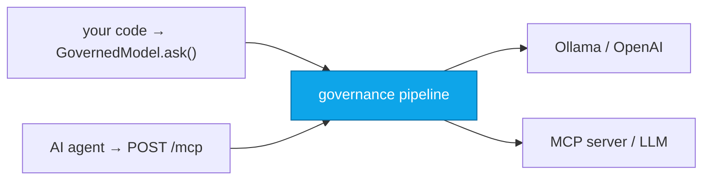

<!--
<p align="center">
  
</p>
-->

<p align="center">
  <strong>Install once, get governed AI.</strong><br>
  <em>PII redacted · Injections blocked · Loops broken · Actions audited · EU AI Act tracked</em>
</p>

<p align="center">
  <a href="https://pypi.org/project/admina-framework/"></a>
  &nbsp;<a href="https://github.com/admina-org/admina/blob/main/LICENSE"></a>
  &nbsp;
  &nbsp;
</p>

<p align="center">
  <a href="https://github.com/admina-org/admina/actions/workflows/ci.yml"></a>
  &nbsp;<a href="https://github.com/admina-org/admina/actions/workflows/release.yml"></a>
  &nbsp;<a href="https://github.com/admina-org/admina/actions/workflows/security.yml"></a>
  &nbsp;<a href="https://pypi.org/project/admina-framework/"></a>
</p>

<p align="center">
  <a href="https://deepwiki.com/admina-org/admina"></a>
  &nbsp;<a href="https://admina.org/docs"></a>
</p>

<p align="center">
  <a href="#quick-start"></a>
  &nbsp;<a href="#see-it-in-action"></a>
  &nbsp;<a href="https://admina.org/docs"></a>
  &nbsp;<a href="https://deepwiki.com/admina-org/admina"></a>
</p>

---

## See it in action

**Scaffold a project and boot the governed proxy + dashboard — no Docker:**

<p align="center">
  
</p>

**Wrap any model in a few lines — PII is stripped before the model ever sees it:**

<p align="center">
  
</p>

**The governance dashboard, before and after simulated traffic — Admina Score 40 → 60:**

<table>
  <tr>
    <td align="center" width="50%">
      <br>
      <em>First boot — Admina Score <strong>40/100</strong></em>
    </td>
    <td align="center" width="50%">
      <br>
      <em>After <code>python scripts/simulate.py</code> — <strong>60/100</strong></em>
    </td>
  </tr>
</table>

---

## Why Admina?

|                                | Plain LLM / RAG app                  | **With Admina**                                                          |
| :----------------------------- | :----------------------------------- | :----------------------------------------------------------------------- |
| PII in prompts/responses       | leaks unless you build redaction     | **Redacted by default** — email, SSN, IBAN, phone, IP, names             |
| Prompt injections              | reach the model                      | **Screened at the proxy** — a heuristic signal, not a guarantee: regex patterns (44 on the Python engine, 15 on Rust) + scoring |
| Agent tool calls               | unaudited                            | **Validated pre-action + logged post-action** (forensic chain)           |
| Loop / runaway agents          | burn tokens / budget                 | **Broken** — TF-IDF cosine similarity over the action stream             |
| EU AI Act readiness            | manual                               | **Gap analysis + risk classification** built-in                          |
| Audit trail                    | logs you hope nobody deletes         | **SHA-256 hash chain** — tamper-evident by design                        |
| Adding governance to existing code | rewrite the call sites           | **Zero code changes** via proxy, or 3 lines via SDK                      |
| Performance overhead           | unknown                              | **Measured** — engine microbenchmarks and a gateway benchmark to run on your hardware ([Performance](#performance--hybrid-python--rust-engine)) |
| License                        | varies                               | **Apache 2.0**, open core                                                |

> Admina is **decision-support and defense-in-depth**, not legal advice. See [Compliance scope](#compliance-scope) for the full disclaimer and limitations.

---

## 30-second example

```python
from admina import GovernedModel, GovernedData, GovernedAgent, ComplianceKit
from admina.plugins.builtin.adapters.ollama import OllamaAdapter
from admina.plugins.builtin.connectors.chromadb import ChromaDBConnector

# Every call is governed: PII redacted, injections blocked, audited
adapter = OllamaAdapter(host="http://localhost:11434")
model = GovernedModel(model_name="llama3.1:8b", adapter=adapter)
response = await model.ask("Summarize this document")

# Data governance: residency enforcement, PII classification
connector = ChromaDBConnector(host="localhost", port=8000)
data = GovernedData(connector=connector, residency_zone="eu")
await data.ingest(documents)

# Agent governance: validate every tool call before execution
async def my_upstream(method, params, **kw): ...  # your MCP/HTTP client
agent = GovernedAgent(upstream=my_upstream)
result = await agent.call("tools/call", {"name": "read_file", "arguments": {}})

# Compliance: EU AI Act gap analysis and risk classification
kit = ComplianceKit()
report = kit.gap_analysis(risk_category="high", current_compliance={...})
```

## Quick Start

### Install from PyPI

```bash
# Recommended for new users: SDK + proxy + dashboard.
# Lets you run `admina dev` and see the dashboard out of the box.
pip install "admina-framework[proxy]"

# Everything (proxy + NLP + telemetry). Use this if you also want
# spaCy-based NER for PII detection or OpenTelemetry export.
pip install "admina-framework[full]"
python -m spacy download en_core_web_sm   # for [full] only

# Model-adapter provider SDKs (per-provider extras):
pip install "admina-framework[openai]"      # openai>=1.0
pip install "admina-framework[ollama]"      # ollama>=0.3
pip install "admina-framework[anthropic]"   # anthropic>=0.39
pip install "admina-framework[mistral]"     # mistralai>=1.0
pip install "admina-framework[gemini]"      # google-genai>=1.0
pip install "admina-framework[bedrock]"     # boto3>=1.34 (AWS Bedrock)

# All provider SDKs at once:
pip install "admina-framework[adapters]"

# Everything (proxy + NLP + telemetry + all adapters):
pip install "admina-framework[all]"
python -m spacy download en_core_web_sm   # for [all] only

# Optional: Rust-accelerated engine (auto-detected at runtime).
# Opt-in extra — pulls in the admina-core wheel from PyPI.
pip install "admina-framework[rust]"

# The proxy for the OpenAI-compatible gateway only: without Redis,
# ClickHouse, boto3 and the scientific stack (see "Embedded deployment").
pip install "admina-framework[proxy-minimal]"

# Advanced: SDK only (no proxy, no dashboard, no `admina dev`).
# Use this when embedding the SDK into another service and you don't
# need the local dev server.
pip install admina-framework
```

> The PyPI distribution name is `admina-framework`; the Python import
> name is `admina` (e.g. `from admina import GovernedModel`). This is
> a normal Python pattern — same as `python-dateutil` → `import dateutil`.

> The Rust engine is an **optional, opt-in** accelerator. The default
> `pip install admina-framework` ships only the pure-Python implementation;
> `admina-framework[rust]` adds the `admina-core` wheel, which Admina
> auto-detects at runtime: under `ADMINA_ENGINE=auto` (the default) the
> firewall and the loop breaker run on Rust whenever it is installed, as in
> the official proxy image (see [Engine selection](#engine-selection)).
>
> The default is pure Python on purpose: the Python injection firewall
> currently has **broader detection coverage** than the Rust one (it adds
> obfuscation-normalisation — homoglyph, leetspeak, base64, ROT13 — and a
> wider multilingual pattern set). Enable `[rust]` when per-request latency
> matters more than that extra coverage. See
> [Performance](#performance--hybrid-python--rust-engine) for the trade-off.

### Or install from source

```bash
git clone https://github.com/admina-org/admina.git
cd admina

# Recommended: proxy + dashboard + infra deps (enables `admina dev`)
pip install -e ".[proxy]"

# Everything (proxy + NLP + telemetry)
pip install -e ".[full]"

# All model-adapter SDKs
pip install -e ".[adapters]"

# Everything (proxy + NLP + telemetry + all adapters)
pip install -e ".[all]"

# CLI workflow
admina init my-project   # Scaffold a governed AI project
cd my-project            # admina dev runs from the project directory
admina dev               # Start the local proxy + dashboard

# Full stack via Docker (no [proxy] extra required)
./scripts/bootstrap-secrets.sh   # Auto-generate .env with random credentials
docker compose up --build        # Credentials printed at bootstrap

# Note: To use the OllamaAdapter, install Ollama (https://ollama.ai)
# and pull a model first: ollama pull llama3.1:8b

# Advanced: SDK only (no proxy, no dashboard)
pip install -e .
python -c "from admina import GovernedModel; print('SDK ready')"
```

Dashboard: [http://localhost:3000](http://localhost:3000) | API docs: [http://localhost:8080/docs](http://localhost:8080/docs)

## Architecture

Admina runs in **dual mode** — in-process via SDK or networked via proxy — but both modes feed the **same governance pipeline**.


```mermaid
flowchart LR
    A1["your code → GovernedModel.ask()"] --> P
    A2["AI agent → POST /mcp"] --> P
    P["governance pipeline"]
    P --> U1["Ollama / OpenAI"]
    P --> U2["MCP server / LLM"]
    classDef pipe fill:#0ea5e9,stroke:#0369a1,color:#fff;
    class P pipe;
```

Pipeline (identical in both modes): `loop-breaker → firewall → PII redaction → guards → audit → forensic chain (SHA-256) → OTEL`

## The 4 Governance Domains

| Domain | Capabilities | Engine |
|--------|-------------|--------|
| **Agent Security** | Anti-injection firewall (heuristic: 44 regex patterns on the Python engine, 15 on Rust, + scoring), loop breaker (TF-IDF cosine similarity) | Rust + Python |
| **Data Sovereignty** | PII redaction (email, SSN, credit cards, IBAN, phone, IP), residency enforcement, data classification | Rust + spaCy NER |
| **Compliance** | EU AI Act risk classification (Art. 6) and gap analysis (Art. 9-15), forensic black box (SHA-256 hash chain), OTEL native spans | Rust + Python |
| **AI Infrastructure** | LLM engine (Ollama, OpenAI), RAG pipeline (ChromaDB), Open WebUI | Python |

All governance domains operate **bidirectionally** — scanning both outbound requests and inbound responses.

## SDK

Four governed primitives, each with async + sync interfaces:

```python
from admina import GovernedModel, GovernedData, GovernedAgent, ComplianceKit
```

| Primitive | Purpose | Governance applied |
|-----------|---------|-------------------|
| `GovernedModel` | LLM calls (Ollama, OpenAI) | PII redaction on prompts and responses, event audit |
| `GovernedData` | Data ingestion and queries | PII classification, residency enforcement, access audit |
| `GovernedAgent` | MCP/A2A agent calls | Firewall, PII, loop breaker — full proxy pipeline in-process |
| `ComplianceKit` | Regulatory compliance | EU AI Act risk classification, gap analysis, report generation |

## Plugin System

9 plugin interfaces, auto-discovered from `plugins/builtin/` or installed via CLI:

| Interface | Builtin implementations |
|-----------|------------------------|
| Model Adapter | Ollama, OpenAI, Anthropic, Gemini, Mistral, Bedrock, vLLM |
| Data Connector | ChromaDB, Filesystem |
| Governance Domain | GuardrailsAI (toxic, jailbreak, bias, PII) |
| Compliance Template | EU AI Act |
| Transport Adapter | MCP, HTTP REST |
| Forensic Store | Filesystem, S3-compatible (boto3 — AWS S3, MinIO, R2, …) |
| Auth Provider | API Key |
| PII Engine | spaCy + Regex (default), Microsoft Presidio (`pip install admina-framework[presidio]`, `ADMINA_PII_ENGINE=presidio`); engines of other packages through the `admina.pii_engines` entry-point group (see [PII engines](#pii-engines)) |
| Alert Channel | Log, Webhook |

Model adapters lazy-import their provider SDK, so install the ones you
use: `pip install admina-framework[adapters]` for all of them, or a
single provider (`[openai]`, `[ollama]`, `[anthropic]`, `[mistral]`,
`[gemini]`, `[bedrock]`). vLLM has no extra of its own — it serves an
OpenAI-compatible API and subclasses the OpenAI adapter, so install
`[openai]` for it.

```bash
admina plugin list                    # List registered plugins
admina plugin install ./my-plugin     # Install a custom plugin
admina plugin create my-domain        # Scaffold a new plugin
```

## CLI

```bash
admina init my-project     # Scaffold project with admina.yaml + docker-compose.yml
admina dev                 # Local mode: proxy + dashboard on :3000 (no Docker)
admina dev --stack         # Docker stack: + redis + clickhouse + grafana
admina dev --with-llm      # --stack + ollama + chromadb + open-webui
admina plugin list         # List all registered plugins
admina plugin install X    # Install a plugin from path or registry
admina plugin create X     # Scaffold a new plugin from template
admina forensic export --from-seq 1 --format jsonl --out records.jsonl
admina forensic verify     # Verify the forensic chain (read-only, JSON result)
admina redteam --format md # Detection-efficacy scorecard of the firewall, PII and loop detectors
admina redteam --corpora-dir corpora/ --config admina.yaml --baseline baseline.json --gate
```

`admina forensic export` and `admina forensic verify` read the directory of a
`filesystem` forensic store (`--dir`, default `$FORENSIC_BASE_DIR`) and never
write to it, so they can run while the proxy does. `export` writes the
records from `--from-seq` on, in sequence order, one per line: the bytes of
each record file as they are, then a newline (`--out FILE`, replaced once
complete, or `-` for standard output). `verify` prints the verification
result (`valid`, `records`, `reason`, `sequence_number`, `checkpoint`,
`last_hash`) and exits with 0 when the chain is valid, 1 when it is not;
`--checkpoint SEQ:HASH` (the `checkpoint` of an earlier result) checks only
the records after it.

`admina redteam` measures the injection firewall, the PII redactor and the
loop breaker on the corpora of the package (`admina/redteam/corpora/`), on
every available engine (`--engine both|python|rust`), then prints the
Markdown scorecard and writes the JSON one to `--out` (`--format
md|json|both`; `--corpus NAME` runs one corpus). `scripts/redteam.py` runs
the same command.

The packaged corpora are small (tens of samples per detector, a few per
language) and their labels are assigned by the maintainers, not by a third
party: read the scorecard as indicative, and measure on corpora of your own
traffic with `--corpora-dir`.

- `--corpora-dir DIR` adds external corpora, run after the packaged ones:
  each `<name>.jsonl` has the rows of the packaged corpus of its detector
  (`{"id", "text", "label": "attack" | "benign", "lang", "tag"}` for the
  firewall, `expected_types` instead of `label` for the PII redactor,
  `messages` instead of `text` with `label` `loop` | `not_loop` for the loop
  breaker), and the directory's `SHA256SUMS` (the output of `sha256sum
  *.jsonl`) lists every one; the hashes are verified before the run.
- `--config FILE` (default `$ADMINA_CONFIG`) builds the Python firewall from
  the `agent_security.firewall` settings of an admina.yaml, as the proxy
  does: custom patterns, pattern packs, disabled categories and patterns,
  heuristic threshold and allowed tags. The Rust firewall is measured only
  when the file sets none of the keys it cannot apply (see
  [Engine selection](#engine-selection)); with `--engine rust`, such a file
  is an error. The PII redactor and the loop breaker keep their defaults.
- `--write-baseline [FILE]` writes the baseline of the run (default:
  `baseline.json` next to `--out`). `--baseline FILE` compares the run with
  a baseline and prints the result on standard error; `--gate` exits with
  status 1 when a recall drops or a false positive appears, when the number
  of benign samples of a corpus differs from the baseline (`fp_samples`:
  regenerate the baseline after changing a corpus), or when a corpus ran
  only on engines the baseline does not declare (default baseline: the
  packaged one, for the packaged corpora with the default settings).
- Exit status 2: an option, a corpus, the configuration or the baseline is
  not valid (a hash that does not match, a row without `tag`, an unknown
  corpus name), or `--engine rust` cannot run a selected corpus
  (`admina-core` is not installed, or `--config` sets a key that only the
  Python firewall applies).

`admina dev` defaults to a **single-process local mode** with zero Docker
dependency: one uvicorn serves the proxy API and the dashboard SPA on the
same port. Use `--stack` for the production-like Docker compose, or
`--with-llm` to also boot local LLM services.

## Dashboard

Real-time governance dashboard on port 3000:

- **Governance Score** — 0-100 composite metric (data residency, audit coverage, attack rate, forensic integrity, EU AI Act compliance)
- **Live Feed** — streaming governance events via WebSocket
- **Compliance Gaps** — EU AI Act gap analysis with article-level detail
- **Infrastructure Health** — proxy, Redis, forensic store, ClickHouse, OTEL status

API backend: `GET /api/dashboard/score`, `/feed`, `/compliance`, `/sovereignty`, `/infra`, `/models`

In `admina dev` local mode the dashboard asks for the API key (`admina password show`)
and keeps a short-lived browser session that only the read-only dashboard API accepts.

In the Docker stack (`docker compose up`) the dashboard container is published on
`127.0.0.1:3000` only. With `ADMINA_API_KEY` set it asks for HTTP Basic Auth
(`ADMINA_DASHBOARD_USER`, default `admin`, and `ADMINA_DASHBOARD_PASSWORD`, which
`./scripts/bootstrap-secrets.sh` and `make up` generate) and adds the key only to the
dashboard's read-only routes (`/api/dashboard/*`, `/api/stats`); it does not start
without a password. `/mcp` and the other `/api/` routes are forwarded as received, so
callers send their own key. Without `ADMINA_API_KEY` the page signs in with the key
as in local mode.
Set `ADMINA_DASHBOARD_ENABLED=false` to stop serving the bundled dashboard.
The session cookie is `Secure` over HTTPS. `DASHBOARD_COOKIE_SECURE=auto` marks it
`Secure` on plain HTTP too, unless the dashboard is opened as `localhost` or a loopback
address: other hosts then sign in over HTTPS only. `DASHBOARD_COOKIE_SECURE=true` always
marks it `Secure`; `false` (the default) only over HTTPS.

## Configuration

Admina uses `admina.yaml` as the primary config file (with `.env` fallback for backward compatibility):

```bash
cp admina.yaml.example admina.yaml   # Copy and customize
```

See [`admina.yaml.example`](https://github.com/admina-org/admina/blob/main/admina.yaml.example) for all options including domains, AI infra, plugins, dashboard, forensic storage, alert channels, and integrations.

### Configuration check

`admina.yaml` is checked against its schema (`schema_version: 1`,
`admina.core.config_schema`):

- A value of the wrong type (a word where a number goes, a single name where
  a list goes, a list where a section goes) is an error naming the key:
  `load_config()` raises `ConfigSchemaError` (a `ValueError`) and the proxy
  does not start, for example `admina.yaml /etc/admina/admina.yaml:
  domains.agent_security.loop_breaker.window_size: must be an integer`. The
  engine factories of the SDK (`get_firewall()`, `get_pii_engine()`,
  `pii_mask_style()`, `get_egress_policy()`) raise the same error, whatever
  key it names, and `admina plugin list` exits with it. The
  values of `gateway` and `presidio` are checked by their own readers, with
  the same effect. An empty value (`key:` and nothing after it) is not
  checked.
- A key the schema does not know, such as the typo
  `domains.agent_security.firewal`, is logged at proxy startup as a warning
  with its path (`admina.yaml /etc/admina/admina.yaml: unknown keys, not
  read: domains.agent_security.firewal ...`). With `ADMINA_CONFIG_STRICT=true`
  it is an error and the proxy does not start. `check_config()` of
  `admina.core.config` runs the same check for the SDK.
- Free-form blocks are not checked inside: `plugin_config`, `integrations`,
  `agent_security.domains`, and the entries of `custom_patterns` (the
  firewall skips a malformed entry with a warning).

At startup the proxy also lists, as a warning, the `ADMINA_*` variables of
its environment and `.env` file that nothing reads (`ADMINA_* variables not read
by Admina: ADMINA_FOO ...`); `ADMINA_CONFIG_STRICT=true` makes them an
error. Known are the proxy settings, the variables read by the
engines, the SDK, the builtin plugins and the other containers of the stack,
and the per-route keys of the gateway. Variables of other components are not
reported when they start with:

- `ADMINA_<NAME>_`, where `<name>` is an entry point that an installed
  distribution registers in `admina.plugins`, `admina.pii_engines` or
  `admina.pattern_packs`, in upper case with `_` for any other character
  than a letter or a digit (entry point `example-pii`:
  `ADMINA_EXAMPLE_PII_`). A plugin reads its own variables under that
  prefix;
- a prefix listed in `ADMINA_ENV_ALLOW_PREFIXES` (comma-separated, for
  example `ADMINA_MYAPP_`).

Values are never logged.

### Engine selection

`ADMINA_ENGINE` selects the engines of the firewall, the loop breaker and the
`spacy-regex` PII engine:

| `ADMINA_ENGINE` | Firewall | Loop breaker | PII (`spacy-regex`) |
|---|---|---|---|
| `auto` (default) | Rust when `admina-core` is installed, else Python; Python, with a warning, when `admina.yaml` sets a key below | Rust when `admina-core` is installed, else Python | Python |
| `python` | Python | Python | Python |
| `rust` | Rust | Rust | Rust |

With `ADMINA_ENGINE=rust` the engines are not built, and the proxy does not
start, when `admina-core` is not installed or when `admina.yaml` sets a key
that only the Python firewall applies: `agent_security.firewall`
`custom_patterns`, `disabled_categories`, `disabled_patterns` or
`pattern_packs` (an empty list is not set). The error names the cause:

```
ADMINA_ENGINE=rust, but admina-core is not installed: install admina-framework[rust], or set ADMINA_ENGINE=python (or auto) to run the Python engines
ADMINA_ENGINE=rust, but admina.yaml sets agent_security.firewall.pattern_packs, which only the Python firewall applies: remove them, or set ADMINA_ENGINE=python (or auto) to run the Python firewall
```

`pattern_pack_dirs`, `strict_pack_timing`, `heuristic_threshold` and
`allowed_tags` do not select an engine (the Rust engine does not read
them). The SDK raises the same `EngineSelectionError` (a `ValueError`) from
`get_firewall()`, `get_loop_breaker()` and `get_pii_engine()`.

Both firewalls are heuristic, and they differ: the Python firewall has 44
builtin patterns in 13 categories, normalises evasions (homoglyphs,
leetspeak, base64, ROT13, hyphenation) and has the Italian baseline; the
Rust firewall has 15 patterns, no normalisation and none of the Italian
baseline patterns, which are simply absent under Rust. See the
[model card](MODEL_CARD.md) for what each one detects.

`GET /health` and `GET /api/stats` report under `engine`:

- as in 0.12: `selection` (`ADMINA_ENGINE` as set, `auto` when unset),
  `active` (the engine that selection resolves to for the firewall and the
  loop breaker), `pii_active`, `rust_available`, `rust_version`
  (`admina_core.version()`, or `null`) and `engine` (`rust` whenever
  `admina-core` is installed);
- `firewall`, `loop_breaker` and `pii`: the engines of the objects the proxy
  built. Under `auto` with a key above, `firewall` is `python` while
  `active` is `rust`. `loop_breaker` is `null` when no enabled surface needs
  one (`mcp`, `integration`); `pii` is `python`, `rust`, `presidio` or the
  name of a plugin engine.

The startup banner and the `admina_engine_info` gauge of `/metrics` report
the same engines, `admina-core` version and settings:

```
  Engine selection: ADMINA_ENGINE=auto (admina-core 0.13.0)
  Firewall: ON (rust engine) | PII Redaction: ON (python engine) | Loop Breaker: ON (rust engine)

admina_engine_info{engine="rust",firewall="rust",loop_breaker="rust",pii="python",pii_redaction="on",rust_available="yes",rust_version="0.13.0",selection="auto",version="0.13.0"} 1
```

The gauge's `engine` is the firewall's engine, `loop_breaker` is `none`
when none is built, and `rust_version` is empty without `admina-core`.
`INJECTION_FAST_PATH_ENABLED=false` and `PII_REDACTION_ENABLED=false` show as
`OFF (gateway and /mcp)`: `/api/v1/validate` runs the firewall and the PII
redaction whatever these two settings say.

**The official proxy image** (`admina/proxy/Dockerfile`) installs the Rust
engine, and spaCy without a language model (the `slim` target has no spaCy).
Under the default `ADMINA_ENGINE=auto` it runs the Rust firewall and loop
breaker and the Python PII engine with regular expressions only: no names or
organisations are detected until a spaCy model is installed (see
[PII engines](#pii-engines)). Set `ADMINA_ENGINE=python` in the container
for the Python firewall, and read `engine.firewall` of `/health` to see the
firewall that runs.

### Firewall patterns

Every firewall pattern has a stable id, reported with each match in
`patterns[].id` of the firewall check and of the forensic record:
`<category>.<language>.<n>` for the builtin categories written in English or
in several languages (`instruction_override.en.1`, `multilang_evasion.it.2`),
`<category>.<n>` for the `it_*` categories, `<pack>:<id>` for the patterns
of a [pattern pack](#firewall-pattern-packs) and `custom.<n>` for the
entries of `custom_patterns`, in their order. A builtin id never changes and
is never reused. `agent_security.firewall.disabled_patterns` leaves out single
patterns by id, where `disabled_categories` leaves out whole categories; an
unknown id is logged as a warning:

```yaml
domains:
  agent_security:
    firewall:
      disabled_patterns: [tool_abuse.en.4]
```

The Python firewall has an Italian baseline besides the Italian patterns of
`multilang_evasion`: `it_instruction_override`, `it_role_hijack`,
`it_prompt_extraction` and `it_model_addressing` (risk `high`). Italian
imperatives of `-are` verbs have the form of the third person ("ignora",
"annulla"), so these patterns and the Italian `multilang_evasion` patterns
match such a verb where an instruction starts (the start of the text, after
a sentence end, a colon, a line break, an opening bracket, a table cell
`|`, an opening tag `<p>`, the start or the end of an HTML comment, an
opening quote or backtick; then closing tags such as `</b>`, a speaker
label such as `Utente>`, a list marker such as `-`, `1)`, `#` or `>`,
emphasis `**`, and up to two words such as "ok,", "grazie,", "per favore",
"assistente,"), after a
clause that starts there with a second-person imperative ("Traduci il
testo e ignora le istruzioni precedenti"; an opening quote, bracket or tag
inside the clause ends it), or with a second-person
object ("... e ignora le tue istruzioni"). Other patterns rest on
second-person forms ("rispondi", "sei ora", "mostrami") and on notes
addressed to an AI system ("Istruzioni per l'IA:"). "Ignora tutte le
istruzioni precedenti" matches; "Il giudice
annulla le linee guida impugnate" does not, and neither does an override
inside a sentence without one of these contexts ("Il documento è lungo,
ignora le istruzioni precedenti") or after a closing quote, tag or emphasis
that follows a word ('Il modulo "Alfa" ignora le istruzioni precedenti',
"<b>Il fornitore</b> ignora le istruzioni precedenti").

`custom_patterns`, `disabled_categories`, `disabled_patterns` and pattern
packs (below) apply to the Python firewall only, and so does the Italian
baseline: with any of those keys set, `ADMINA_ENGINE=auto` runs the Python
firewall and `ADMINA_ENGINE=rust` stops the proxy (see
[Engine selection](#engine-selection)).

#### Firewall pattern packs

A pattern pack is a named, versioned set of firewall patterns in a YAML or
JSON file, added to the builtin patterns when
`agent_security.firewall.pattern_packs` names it
([`examples/pattern_packs/example-pack.yaml`](examples/pattern_packs/example-pack.yaml)):

```yaml
name: example-pack              # [a-z0-9][a-z0-9-]*, the file name without suffix
version: "1.0.0"                # a string
description: Example patterns.  # optional
patterns:                       # at least one
  - id: internal_notes          # [a-z0-9][a-z0-9_.-]*, unique in the pack
    regex: "\\b(?:show|reveal|print)\\s++(?:me\\s++)?(?:the\\s++)?internal\\s++(?:ticket\\s++)?notes\\b"
    category: example_disclosure  # [a-z0-9][a-z0-9_]*
    risk_level: high            # low | medium | high | critical
```

No other key is accepted. The firewall knows each pattern as
`<pack>:<id>` (`example-pack:internal_notes`): check results report it and
`disabled_patterns` accepts it. Pack patterns follow the builtin ones and
precede `custom_patterns`; `disabled_categories` applies to their
categories too.

```yaml
domains:
  agent_security:
    firewall:
      pattern_pack_dirs: [/etc/admina/packs]   # or ADMINA_PATTERN_PACK_DIRS
      pattern_packs: [example-pack]
      strict_pack_timing: false
```

Admina looks for each listed name among the entry points of the group
`admina.pattern_packs`, then in each directory of `pattern_pack_dirs`, in
order (`<name>.yaml`, `<name>.yml`, `<name>.json`; relative directories
from the working directory). `ADMINA_PATTERN_PACK_DIRS`, directories
separated by `:` (`;` on Windows), replaces `pattern_pack_dirs` when set.
An installed distribution provides a pack with an entry point whose loader
returns the pack mapping or the path of a pack file in its package data:

```toml
[project.entry-points."admina.pattern_packs"]
example-pack = "example_pkg.packs:example_pack"
```

A name must come from exactly one source. The firewall is not built, and
the proxy does not start, when a listed pack is not found (the error lists
the available packs), comes from two sources, is listed twice, or does not
validate (the error names the file or entry point and the key path, such as
`patterns[1].risk_level`), and when a pack directory is missing. Each pack
pattern is timed on 64k-character inputs when the firewall is built
([pattern timing](#pattern-timing)): a pattern over 50 ms is logged as a
warning naming its id, or stops the firewall with
`strict_pack_timing: true`. Admina ships no pack of its own besides the
example.

#### Firewall deep path

The deep path scores five heuristic signals (imperative words, special
characters, context switches, length, escape sequences) and flags a text
whose score reaches `agent_security.firewall.heuristic_threshold` (default
`0.5`). Separators (`---`, `===`), `###`, code fences and tags count as
context switches, except the tags named in `allowed_tags` (any case), such
as the tag your application puts around retrieved documents. HTML entities
(`&euro;`, `&#8364;`) and percent-encoding (`%20`) are not escape sequences,
and only a text longer than 100 000 characters gets the length signal.
`INJECTION_DEEP_PATH_ENABLED=false` turns the deep path off: a text is then
flagged by the patterns only.

```yaml
domains:
  agent_security:
    firewall:
      heuristic_threshold: 0.5
      allowed_tags: [source]
```

`heuristic_threshold` and `allowed_tags` apply to the Python firewall; the
Rust engine scores with signals and a threshold of its own, and follows
`INJECTION_DEEP_PATH_ENABLED`.

#### Pattern timing

Custom firewall rules (`agent_security.firewall.custom_patterns`) run on
Python's backtracking `re` engine. Check each one on long inputs before
deploying it:

```python
from admina.domains.agent_security.pattern_timing import measure_pattern, probe_pattern

probe_pattern(r"delete\s+user\s+\d+")    # worst search time in ms on 64k-character inputs
measure_pattern(r"delete\s+user\s+\d+")  # the same, with the slowest input and all timings
```

A result above 50 ms flags a pattern that is too slow on some long input. One
whitespace quantifier between two literals, with the whitespace inside each
optional group and possessive quantifiers (`\s++`, `\s*+`) where a whitespace
run is followed by a literal, keeps the backtracking over a whitespace run
linear in the length of the run.

That rule does not limit how many positions a search starts from. A pattern
that begins with a repeated character class can start at every position of a
long run of that class and read to the end of the run each time:
`\b[\w.]+=\d` passes the probe, yet takes time proportional to the square of
the run length on `a.a.a.…` (no `=`). The generated inputs contain no such
runs, so time them as well:

```python
import re
from admina.domains.agent_security.pattern_timing import search_ms

search_ms(re.compile(r"\b[\w.]+=\d"), "a." * 32768)   # ms on a 64k-character run
```

Anchoring the start of the run, `(?<![\w.])[\w.]++=\d`, gives one attempt per
run (a match then starts where the run starts).

### Request size limits

`ADMINA_MAX_REQUEST_BYTES` (default 10 MiB, `0` = no limit) caps the request
body on every route. A body over the cap gets 413 before it is parsed: at once
when its `Content-Length` is over the cap, otherwise as soon as the bytes read
go over it. The 413 body is in the OpenAI error format on `/v1`
(`invalid_request_error`, code `request_too_large`) and `{"detail": ...}`
elsewhere. `MAX_REQUEST_TOKENS` (default 100000, `0` = no limit) caps the
request content on `/mcp`, estimated as the length in characters of the
scanned text. `ADMINA_GATEWAY_MAX_PROMPT_CHARS` (default `0`, no limit) caps
the message text of `POST /v1/chat/completions`, in characters (the text of
every message, as scanned); longer requests get 413 (`invalid_request_error`,
code `prompt_too_long`) before any governance check.

### PII engines

`ADMINA_PII_ENGINE` (or `pii_engine` in `admina.yaml`, default `spacy-regex`)
selects the engine of PII redaction: a built-in engine (`spacy-regex`,
`presidio`) or an engine that another package registers in the
`admina.pii_engines` entry-point group. An unknown name stops the proxy at
startup with the list of the engines available.

```toml
[project.entry-points."admina.pii_engines"]
example-pii = "example_pkg.engine:ExamplePIIEngine"
```

The entry point names a `BasePIIEngine` subclass (`admina.plugins`), or a
callable that returns one; a `config` parameter receives the engine's block of
`plugin_config` in `admina.yaml`. Admina runs the engine through
`admina.engines.PIIEngineBridge`, which calls its asynchronous `detect` and
`redact` on an event loop of the engine's own, from any thread, and returns
`{"redacted_text", "entities", "categories", "count"}`; entities carry the
type, offsets and length of each span, never its text. `special_categories`
of the engine lists the special categories of personal data (GDPR art. 9 and
10) among its types: `DataClassifier(special_categories=...)` classifies them
`restricted`, like the built-in `SPECIAL_CATEGORIES`.

`ADMINA_PII_MASK_STYLE` (or `pii_mask_style` in `admina.yaml`) chooses the
masks: `typed` (default) replaces each span with its type (`[EMAIL]`,
`[PERSON]`, …); `omissis` replaces each span with `[OMISSIS]`, in requests,
responses and streamed responses alike, so no type is left in the text. In
`omissis`, the categories an engine lists in `sentence_categories` (such as
health or judicial data) have their whole sentence replaced; the sentences
come from the engine's `sentences(text)`, by default a simple splitter (a
line break, or `.`, `!`, `?` followed by an upper-case word, ends a
sentence). A streamed response from such an engine is then released a whole
sentence at a time (at most 4096 characters held back).

`ADMINA_PRESIDIO_NLP_MODELS` (or `presidio.nlp_models` in `admina.yaml`) sets
the spaCy pipeline of each language of the `presidio` engine, for example
`it:blank,en:en_core_web_sm`: an installed model, or `blank`, a tokenizer with
no model and no NER (the pattern recognizers, such as e-mail, IBAN, fiscal
codes and phone numbers, still run). A configured model that is not installed
stops the proxy at startup: models are never downloaded. Without the setting,
each of `en_core_web_sm` and `it_core_news_sm` that is installed is used.

The PII engines work without network access: the `presidio` engine checks
e-mail domains against the public suffix list bundled with `tldextract`,
without downloading it or writing a cache. `ADMINA_OFFLINE=true` (default
`false`) also sets `HF_HUB_OFFLINE`, `TRANSFORMERS_OFFLINE` and
`HF_DATASETS_OFFLINE` to `1` before a PII engine is built and when the proxy
starts (engines built on Hugging Face libraries then load only local files),
and starts the proxy without the OpenTelemetry exporter.

Every engine masks text values only, never the keys of a JSON object: the
gateway redacts the text of each message (`content`, as a string or the
`text` of each part, reasoning and refusal text, tool call `arguments`) and
forwards roles, names and ids as received. A mask of Admina already in the
text (`[EMAIL]`, `[IBAN]`, …, `[OMISSIS]`) is never masked again; other text
in square brackets is masked like any other text. IBANs are masked when they
have the length of their country (Italy: 27 characters), compact or with
spaces, and a valid checksum; phone numbers include the Italian formats.

### Embedded deployment

Settings for running the proxy as one component of a larger system (a
container, a service unit). Each one defaults to the behaviour described in
the rest of this README.

**Configuration file.** `ADMINA_CONFIG` names the `admina.yaml` to load, for
example `/etc/admina/admina.yaml`. When it is set, exactly that file is read
by the proxy, the engines and the SDK's `load_config()`; a missing,
unreadable or invalid file stops the proxy at startup instead of falling
back to the defaults. Unset (or empty), Admina looks for `admina.yaml` in the
current directory, then in the directory of the `admina` package.

**Secrets from files.** `ADMINA_API_KEY_FILE` and
`ADMINA_FORENSIC_STATE_KEY_FILE` name files holding the API key and the
forensic chain-state key (for example `/run/secrets/admina_api_key`), as the
upstream key files of the gateway do. Each file is read once at startup, with
one trailing newline removed. A missing, unreadable or empty file, or a key
set both directly and as a file, stops the proxy; the error names the
setting and the path, never the key. `ADMINA_FORENSIC_STATE_KEY_FILE` inside
the forensic directory stops it too: the key must be kept outside the store.

**Forensic store.** `FORENSIC_BACKEND` (`memory`, `filesystem`, `s3`) and
`FORENSIC_BASE_DIR` choose where the forensic records go. When they are not
set (in the environment or `.env`), the proxy reads
`domains.compliance.forensic.backend` (or its older name `storage`) and
`base_dir` from `admina.yaml`; without either, the backend is `memory`. A
value set in both places with different values is logged at startup, and
the environment's is used. The Docker Compose stack uses `filesystem` with
`FORENSIC_BASE_DIR=/app/.admina/forensic` on the named volume
`forensic-data`, which the proxy image creates owned by its user.

`ADMINA_FORENSIC_FAIL_MODE` says what happens when a record cannot be
written (a full disk, a directory that cannot be written, S3 errors):

| | `open` (default) | `closed` |
|---|---|---|
| Record not written | logged; the request is served without it | `503` and not forwarded: gateway `{"error": {..., "type": "server_error", "code": "forensic_unavailable"}}`, `/mcp` a JSON-RPC error (`-32603`), `/api/v1/audit` `503` |
| `/api/v1/validate` after a failed write | served | `503` until a record is written again |
| Backend that cannot be opened at startup (`filesystem` without a directory, or one that cannot be created or written; `s3` without boto3 or not reachable; a record that cannot be read) | an error is logged; nothing is recorded, not even in memory, and `/health` reports `forensic_writable: false` | the proxy does not start |

A record that is not written is never counted: the next one takes its
sequence number. Each record, `_chain_state.json` and its signature are
written atomically (a temporary file in the same directory, fsynced and
renamed, then the directory fsynced).

**Forensic records** (format `admina-forensic/1`). Each record is one JSON
object on one line, at `YYYY/MM/DD/HH/NNNNNNNN.json` under the store
directory (UTC hour of the write, sequence number on eight digits), with
`sequence_number` (from 1, contiguous), `timestamp_utc`,
`timestamp_unix_ms`, `previous_hash` (`GENESIS` for record 1, else the
`record_hash` of the record before), `event`, and:

- `record_hash`: SHA-256 (64 lowercase hex characters) of
  `json.dumps(record, sort_keys=True, default=str)` (default separators,
  UTF-8) of the record **without `record_hash`, `record_sig` and
  `record_sig_alg`**;
- `record_sig`: HMAC-SHA256 (64 lowercase hex characters) of the 64 ASCII
  characters of `record_hash`, under the record key = HMAC-SHA256 of
  `admina-forensic/1 record signature` under the chain-state key
  (`ADMINA_FORENSIC_STATE_KEY` or `ADMINA_FORENSIC_STATE_KEY_FILE`, kept
  outside the forensic directory); `record_sig_alg`: `hmac-sha256`. Without
  a key a record has `record_sig_alg: "none"` and no `record_sig`.

The chain state (`_chain_state.json`, with its HMAC-SHA256 in
`_chain_state.json.sig` when a key is set) holds `record_count`,
`chain_head`, `head_key` and `signed_from`: the first sequence number whose
record must be signed (records written before a key was set stay readable
and are reported as unsigned).

Verification (`GET /api/v1/forensic/verify`, `admina forensic verify`,
`verify_chain()`) reads one record at a time in sequence order and returns
`valid`, `records`, `last_hash`, `checkpoint` (`{"sequence_number",
"record_hash"}` of the last record checked: pass it back as
`?checkpoint=SEQ:HASH`, `--checkpoint SEQ:HASH` or `checkpoint=(seq, hash)`
to check only the records after it; `from_seq` starts from a sequence
number instead), `signed`, `unsigned`, `signatures_verified` (false without
the key) and, for the first failure, `sequence_number` and `reason`:

| `reason` | The record at `sequence_number` |
|---|---|
| `hash_mismatch` | is not a JSON object, or its `record_hash` is not the hash of its content |
| `sequence_gap` | has a `sequence_number` other than its file's, or comes twice or out of order |
| `signature_invalid` | has a `record_sig` that does not verify with the key, or an unknown `record_sig_alg` |
| `unsigned` | has no signature, though records from `signed_from` on must have one |
| `link_broken` | has a `previous_hash` that is not the `record_hash` of the record before it |
| `missing_record` | cannot be found: sequence numbers start at 1 and follow one another up to the chain state's count at least |
| `state_mismatch` | is the chain state's last record and has another hash |
| `checkpoint_mismatch` | is the checkpoint's and has another hash |
| `state_missing` | — there are records but no chain state |
| `state_invalid` | — the chain state cannot be read, or its HMAC does not verify with the key |
| `store_unavailable` | — the backend could not be opened |

**Chain state at startup.** The store reads the chain state and, with a
key, checks its HMAC. An S3 read is retried (`FORENSIC_S3_MAX_RETRIES`
times, backoff from `FORENSIC_S3_BASE_DELAY_S`); an object is missing only
when S3 answers that it does not exist (`NoSuchKey`), and any other error
still there after the retries is a read error, as for a file:

- a valid state is used; the record at its count must be its head, and a
  record written after it (the process stopped between the record and the
  state) is counted when it verifies and links to it;
- a missing state (with records), or one that cannot be read or does not
  verify, is rebuilt **only** from records that all verify with the key,
  from record 1 on (sequence, hashes, links, signatures). The rebuild is
  logged at `CRITICAL` (`Forensic chain state rebuilt from verified
  records`) and recorded as a signed record with `event.event_type:
  "chain_state_rebuilt"`, `cause` (`state_missing` or `state_invalid`),
  `records_verified` and `head_hash`.
  An external copy of the head (for example the `checkpoint` of the last
  export) shows whether records after it are missing;
- otherwise (no key, a record that does not verify, a missing last record)
  the chain is **invalid**: a `CRITICAL` log names the reason and the
  record, `/health` reports `forensic_chain: "invalid"` and `status:
  "degraded"`, no record is written, verification is never valid, and with
  `ADMINA_FORENSIC_FAIL_MODE=closed` governed requests are answered `503`;
- a record that cannot be read keeps the backend from opening (see the
  table above).

To recover from an invalid chain: run `admina forensic verify` (or `admina
doctor` for S3), with the key in the environment, to see the reason and the
record; stop the proxy; restore the forensic directory or bucket (records,
`_chain_state.json`, `_chain_state.json.sig`) from a backup, or move it
aside, keeping it, and start with an empty one; start the proxy. A chain
state that could not be read because the storage was unavailable (logged as
`Cannot read the forensic chain state`) needs only a restart once it can be
read again. A store written without a key, or before a key was set, cannot
be rebuilt: keep its chain state, or move it aside when a key is
introduced.

**Audit records.** `POST /api/v1/audit` records the event it receives with
`source: "api_v1_audit"` (a `source` in the request is kept as
`client_source`) and `submitted_by`: the credential the request was admitted
with (`api_key`, `append_key`, `user:<id>` or `unauthenticated`). An
`event_type` of the records the proxy writes itself (`mcp_request`,
`mcp_response`, `gateway_request`, `gateway_response`, `gateway_response_scan`,
`policy_violation`, `chain_state_rebuilt`) is refused with `400`.
`ADMINA_AUDIT_APPEND_KEY` (or `ADMINA_AUDIT_APPEND_KEY_FILE`) is a key that
this route accepts besides the API key and every other route refuses; unset
(the default), the route needs the API key.

**Surfaces.** `ADMINA_ENABLED_SURFACES` lists the surfaces the proxy serves,
comma-separated (empty = all of them):

| Surface | Routes |
|---------|--------|
| `gateway` | `/v1/*` (OpenAI-compatible gateway) |
| `mcp` | `/mcp`, `/mcp/*` |
| `integration` | `/api/v1/*` (validate, audit, forensic verify) |
| `compliance` | `/api/compliance/*` |
| `dashboard` | `/api/dashboard/*` (live feed and browser sign-in included), `/api/stats`, `/api/events`, the dashboard shell (`/`, `/heimdall.png`, `/vendor/*`) |

The routes of a disabled surface are not mounted and answer 404, with or
without the API key. `/health` and `/metrics` are always served. The loop
breaker is built only when `mcp` or `integration` is enabled, the
coordination detector and its quarantine refresh loop only with `mcp`, and
the gateway's pipeline threads only with `gateway`.

**Egress per surface.** `agent_security.egress.surfaces` in `admina.yaml`
lists the surfaces the egress stage runs on, among `gateway` (the text of
the chat messages of `POST /v1/chat/completions`), `mcp` (the arguments of
`/mcp` tool calls), `integration` (`/api/v1/validate`) and `sdk`
(`GovernedModel.ask()` and `stream()`). Unset, the stage runs on every one;
an empty list runs it on none. An unknown name, or a value that is not a
list, stops the proxy at startup (the SDK raises `ValueError`). To check
tool calls only:

```yaml
domains:
  agent_security:
    egress:
      enabled: true
      surfaces: [mcp]
      allow: [api.example.com]
```

With `gateway` left out, the gateway does not evaluate the text of chat
messages for destinations (a message that starts with a URL off the
allowlist is not refused by the stage) and its records have no
`checks.egress`.

**Optional dependencies.** `redis` is imported only when `REDIS_URL` has a
Redis scheme, `clickhouse_connect` only when `CLICKHOUSE_HOST` is not empty
and `boto3` only when `FORENSIC_BACKEND=s3`. `REDIS_URL=` and
`CLICKHOUSE_HOST=` (empty) turn Redis and ClickHouse off with no connection
attempt. The `proxy-minimal` extra installs the proxy without Redis,
ClickHouse, boto3, typer and the scientific stack of the Python loop breaker:

```bash
pip install "admina-framework[proxy-minimal]"
ADMINA_ENABLED_SURFACES=gateway REDIS_URL= CLICKHOUSE_HOST= \
  ADMINA_API_KEY_FILE=/run/secrets/admina_api_key \
  uvicorn admina.proxy.main:app --host 0.0.0.0 --port 8080
```

With `proxy-minimal`, the `mcp` and `integration` surfaces need the `proxy`
extra (or `rust`, whose loop breaker needs no scientific stack); the proxy
does not start when they are enabled without it.

**Health.** `GET /health` (public) reports:

```json
{
  "status": "healthy",
  "service": "admina-proxy",
  "version": "0.13.0",
  "mode": "enforce",
  "surfaces": ["gateway"],
  "ruleset_sha256": "9cada1f2c9c85e60d1ec53ede74fbec7524f1db6e324500c46105f4d174c980a",
  "forensic_writable": true,
  "forensic_chain": "ok",
  "engine": {
    "engine": "rust",
    "rust_available": true,
    "rust_version": "0.13.0",
    "selection": "auto",
    "active": "rust",
    "pii_active": "python",
    "firewall": "rust",
    "loop_breaker": null,
    "pii": "python"
  },
  "timestamp": "2026-09-28T23:37:06.472687+00:00"
}
```

- `status`: `healthy`, or `degraded` while forensic records cannot be
  written (`forensic_writable` is `false`, the last record or chain-state
  write failed, or the chain is invalid); the HTTP status is 200 either way;
- `forensic_chain`: `ok`, `rebuilt` (the chain state was rebuilt from
  verified records at startup) or `invalid` (see
  [Embedded deployment](#embedded-deployment), *Chain state at startup*);
  `null` for the `memory` store;
- `mode`: the governance mode (`enforce`, `observe` or `dry-run`);
- `surfaces`: the enabled surfaces;
- `ruleset_sha256`: the active firewall ruleset, the value of
  `X-Admina-Ruleset` (see [Firewall ruleset](#firewall-ruleset));
- `forensic_writable`: whether the forensic store accepts writes. With the
  `filesystem` backend a probe file is created, written, fsynced and removed
  in `FORENSIC_BASE_DIR`; with `s3` it is the result of the last record
  write (`null` before the first); with `memory` it is `null`; for a
  backend that could not be opened at startup it is `false`. The check
  runs at most once every 10 s, on a thread of its own, and its result is
  reused until then; a check that takes longer than 1 s reports `false`, so
  `/health` answers within about a second even when the store stalls.

**Logs.** `ADMINA_LOG_FORMAT=json` writes one JSON object per line
(`timestamp`, `level`, `logger`, `message` and `exception` when there is
one), uvicorn's own lines included; `text` is the default. An exception
raised while a request or a response is governed (by a governance guard,
the PII engine, the pipeline or the upstream exchange of the gateway,
`/mcp` and `/api/v1/validate`) is logged by its class name, and at `DEBUG`
with the frames of its traceback (`admina.core.exception_log`), never with
its message, which can quote the governed text; the `error` of a guard's
`ERROR` check (`checks["guard_<name>"]` in the forensic records and the
ClickHouse `details`) is the class name too. An `/mcp` request whose
governance pipeline raises is answered `500` (JSON-RPC `-32603`,
`Internal proxy error`), a `POST /api/v1/validate` request `500`
(`{"detail": "Internal Server Error"}`).

**`/metrics` and the API docs.** Both are public by default.
`ADMINA_METRICS_REQUIRE_AUTH=true` and `ADMINA_API_DOCS_REQUIRE_AUTH=true`
put `/metrics` and `/docs`, `/redoc`, `/openapi.json` behind the API key
(`X-API-Key` or `Authorization: Bearer`); a browser opening `/docs` then
cannot load the schema. `ADMINA_API_DOCS_ENABLED=false` removes the docs.

**Governed requests.** Each request the proxy governs on the gateway
(`POST /v1/chat/completions`), on `/mcp` and on `POST /api/v1/validate`
(the `integration` surface) is counted on `/metrics` and emits one
`governance.decision` event on the event bus, which the dashboard live feed,
the OpenTelemetry exporter and the alert channels read (one alert per
`BLOCK` or `CIRCUIT_BREAK`). With ClickHouse configured it is also a row of
`governance_events`: `event_type` `gateway_request`, `mcp_request` or
`validate_request`, `request_hash` the event's `request_sha256`, and for
the gateway `response_hash` the SHA-256 of the response sent. A gateway
request is recorded once its response has ended, an `/mcp` request once it
has been answered: each with the action of its response.

- `admina_requests_total{surface,action}`: counter per surface (`gateway`,
  `mcp`, `integration`; the enabled ones have samples from startup) and
  action: `ALLOW`, `BLOCK`, `REDACT` (allowed, with PII masked in the
  request), `CIRCUIT_BREAK`, or `ERROR` (the request failed in the proxy
  before the governance pipeline decided). A gateway completion answered
  with the block message after the upstream answered (flagged by the
  response scan, or whose PII redaction did not finish) is a `BLOCK`; so
  is an `/mcp` request whose response a governance guard blocks (its
  `inspect_response` verdict, or its contract error with
  `ADMINA_GUARD_FAIL_MODE=closed`), with the guard's `risk_level` (`HIGH`
  for a contract error), and so are `/mcp` requests over the rate limits or
  `MAX_REQUEST_TOKENS`.
  Requests refused before they are governed are not counted: gateway
  requests answered before they have an event id (unknown route, a body
  that is not a JSON object, a model outside the allowlist, a refused
  value, a prompt over `ADMINA_GATEWAY_MAX_PROMPT_CHARS`), and
  `/api/v1/validate` requests answered `400` or `503`.
- `admina_request_duration_seconds{surface}`: histogram of the time from
  the arrival of a request to the end of its response, the upstream's time
  included (buckets from 5 ms to 300 s).
- `admina_governance_duration_seconds{surface}`: histogram of the time the
  governance pipeline took to decide (buckets from 0.5 ms to 5 s).
- `admina_requests_blocked_total` (`BLOCK`, `CIRCUIT_BREAK`),
  `admina_requests_allowed_total` (`ALLOW`, `REDACT`),
  `admina_requests_redacted_total` (`REDACT`) and `admina_avg_latency_ms`
  (the mean request duration) count every governed surface, as do the
  `requests_*` counters of `/api/stats`.

Label values come from these fixed sets only, never from a request. The
metadata of a `governance.decision` event is `surface`, `event_id` (of the
request's forensic records; a new id for `/api/v1/validate`), `domain` (the
part of the pipeline that decided: `firewall`, `pii`, `loop_breaker`, a
guard's name, `pipeline`, `response_firewall`, `response_pii`,
`response_guard` or `none`),
`latency_us` (the pipeline's time), `categories` (firewall category names),
`pii_count`, `request_sha256` and, in `observe` and `dry-run` mode,
`would_action`: names, counts and hashes, never text of a request or of a
response. `request_sha256` is, for the gateway, the `request_sha256` of the
request record; for `/mcp`, the SHA-256 of the JSON-RPC request as the
proxy serialises it; for `/api/v1/validate`, the SHA-256 of `content`.

**OpenTelemetry.** With `OTEL_ENABLED=true` (the default), the `telemetry`
extra installed and `ADMINA_OFFLINE` off, the proxy exports to
`OTEL_ENDPOINT` (OTLP gRPC, default `http://localhost:4317`; an empty value
leaves the endpoint to the OpenTelemetry SDK: `OTEL_EXPORTER_OTLP_ENDPOINT`,
else `http://localhost:4317`) a span per `governance.decision` event, with
`admina.domain`, `admina.action`, `admina.risk_level`, `admina.latency_us`,
`admina.session_id` and `admina.meta.<key>` for each key of the event's
metadata, and the span of each gateway chat completion.
`OTEL_ENABLED=false` builds no exporter: nothing is exported and no
connection is made for telemetry.

**Container entrypoint.** `admina/proxy/docker-entrypoint.sh` accepts
`ADMINA_API_KEY` or `ADMINA_API_KEY_FILE` and prints only whether the key
is set, never any part of it.

### OpenAI-compatible gateway

The proxy serves an OpenAI-compatible API at `/v1` (`POST /v1/chat/completions`,
streaming and non-streaming, and `GET /v1/models`). It runs the governance
pipeline on each chat completion and forwards requests to an upstream route.
By default there is one route, `default`, to `ADMINA_GATEWAY_UPSTREAM`
(`http://localhost:11434/v1`), and no credentials are sent upstream.

`ADMINA_GATEWAY_MODELS_ALLOWLIST` (comma-separated model ids; empty, the
default, = every model) limits the models: `GET /v1/models` lists only those,
and a chat completion for any other model, or without a model, gets 403 in
the OpenAI error format (`invalid_request_error`, `param: "model"`, code
`model_not_allowed`) before any governance check, forensic record or upstream
call.

A chat completion is forwarded with its body as received and its messages as
governed (PII redacted when redaction applies). Three settings, all off by
default, change the other top-level fields of the forwarded body:

| Setting | Default | Meaning |
|---|---|---|
| `ADMINA_GATEWAY_FORWARD_FIELDS` | empty: every field | fields forwarded, comma-separated and case-sensitive; `model`, `messages` and `stream` always are, and so are the fields of a limit below that is set; any other field is left out |
| `ADMINA_GATEWAY_MAX_N` | `0`: no limit | largest `n` forwarded: a larger `n` is lowered to it; an absent or `null` `n` is forwarded as it is |
| `ADMINA_GATEWAY_MAX_COMPLETION_TOKENS` | `0`: no limit | largest `max_tokens` and `max_completion_tokens` forwarded: each one that is larger is lowered to it, and a request that sets neither (absent or `null`) is forwarded with `max_tokens` set to it |

```bash
ADMINA_GATEWAY_FORWARD_FIELDS=temperature,top_p,stop,seed,tools,tool_choice,response_format,stream_options
ADMINA_GATEWAY_MAX_N=1
ADMINA_GATEWAY_MAX_COMPLETION_TOKENS=4096
```

While a limit is set, the fields it applies to must be absent, `null` or an
integer of at least 1 (`true`, `2.0` and `"2"` are not); any other value gets
400 in the OpenAI error format (`invalid_request_error`, `param` naming the
field, code `invalid_value`) before any governance check, forensic record or
upstream call. The proxy does not start when `ADMINA_GATEWAY_FORWARD_FIELDS`
names a field with characters other than ASCII letters, digits, `_` and `-`.
These settings change the forwarded body only: the firewall scans the request
as received, and the forwarded `messages`, whose hash is `request_sha256`, are
the same with or without them.

Named routes come from `ADMINA_GATEWAY_UPSTREAMS` or from `gateway.upstreams`
in `admina.yaml`; the environment variable, when set, replaces the YAML routes
(URLs and key files):

```bash
ADMINA_GATEWAY_UPSTREAMS=main=http://main.upstream.test/v1,util=http://util.upstream.test/v1
ADMINA_GATEWAY_UPSTREAM_API_KEY_FILE=/run/secrets/upstream_api_key
```

```yaml
gateway:
  upstreams:
    main: { url: "http://main.upstream.test/v1", api_key_file: /run/secrets/upstream_api_key }
    util: { url: "http://util.upstream.test/v1", api_key_file: /run/secrets/upstream_api_key }
  default_upstream: main
```

A request picks a route with the `X-Admina-Upstream` header. Without it the
gateway uses `default_upstream`, or else the first route; an unknown route name
gets a 400 response in the OpenAI error format (`invalid_request_error`, code
`unknown_upstream`) and is neither scanned nor recorded. The route name is
stored in the forensic record (`upstream`).

The upstream receives `Authorization: Bearer <key>` when the route has a key.
The key of a route is the first one set, in this order:

| Source | Scope |
|---|---|
| `ADMINA_GATEWAY_UPSTREAM_<NAME>_API_KEY` or `…_API_KEY_FILE` (`<NAME>`: route name in upper case) | one route |
| `api_key_file` of the route in `admina.yaml` | one route |
| `ADMINA_GATEWAY_UPSTREAM_API_KEY` or `ADMINA_GATEWAY_UPSTREAM_API_KEY_FILE` | every route |

Key files are read once at startup and one trailing newline is removed. The
proxy does not start when a key file is missing, unreadable or empty, when a
key is set both directly and as a file, when a route is malformed or when
`default_upstream` names no route. Keys are masked in the settings
representation and are not logged. The caller's `Authorization`, `X-API-Key`,
`Cookie` and `X-Admina-*` headers are never forwarded upstream; other headers
only when listed in `ADMINA_GATEWAY_FORWARD_HEADERS` (see
[Correlation and forensic records](#correlation-and-forensic-records)).

#### Upstream responses, errors and timeouts

`ADMINA_GATEWAY_STREAM_MODE`, or `gateway.stream_mode` in `admina.yaml` (the
environment variable wins), sets how streamed chat completions are relayed:

| Mode | Behaviour |
|---|---|
| `passthrough` (default) | While no response transformation is active (`PII_REDACTION_ENABLED=false`), the client receives the upstream bytes unchanged, every field included, each SSE event as soon as it is complete. With PII redaction on, the gateway relays as in `governed`. |
| `governed` | Each SSE chunk is parsed and re-serialised, one chunk for each upstream chunk, with all of its fields. With PII redaction on, every string of a choice is redacted, per choice and per field across chunks: `content` (a string or a list of parts), reasoning text, tool and function call `arguments` and any other field; text held back to catch an entity split across chunks is sent with the choice's finish chunk, at the same place, or in a last chunk at the end of the stream. `data: [DONE]` is sent when the upstream sends it. |

A non-streaming response is forwarded unchanged unless PII redaction is on;
then the gateway parses it, and a successful response that is not a JSON
object gets 502 (code `upstream_invalid_response`). An upstream error (4xx,
5xx) reaches the client with its status, body and content type, streaming or
not.

With PII redaction on, in streamed and non-streaming completions alike:

- structural values are kept as they are: `index`, `id`, `type`, `role`,
  `name` and `finish_reason`, and the completion's `id`, `object`,
  `created`, `model`, `system_fingerprint` and `service_tier`;
- `logprobs` and `token_ids` of each choice are sent as `null`, since
  generated text split into tokens cannot be redacted token by token;
- other strings outside the choices, and SSE comment lines, are redacted as
  whole values;
- values nested more than 16 levels deep are dropped.

The gateway talks to its upstreams through a client of its own:

| Setting | Default | Meaning |
|---|---|---|
| `ADMINA_GATEWAY_TIMEOUT_CONNECT` | `30` | seconds to open a connection or get a free one from the pool |
| `ADMINA_GATEWAY_TIMEOUT_READ` | `30` | seconds to wait for the next upstream bytes (and for each write of the request) |
| `ADMINA_GATEWAY_TIMEOUT_TOTAL` | `0` | seconds for the whole upstream exchange, from the request to the last byte |
| `ADMINA_GATEWAY_MAX_CONNECTIONS` | `100` | size of the connection pool |
| `ADMINA_GATEWAY_MAX_KEEPALIVE_CONNECTIONS` | `20` | idle connections kept open |

A timeout of `0` means no limit. A timeout before the response starts gets
504, any other connection failure 502, both with an OpenAI-style body
(`{"error": {"message", "type": "upstream_error", "param", "code"}}`, code
`upstream_timeout` or `upstream_error`). A failure during a stream ends it
with one `data: {"error": {...}}` event and no `data: [DONE]`. When the client
disconnects, the gateway closes the upstream request.

#### Governance pipeline threads and time budget

The gateway runs the governance pipeline (firewall, PII redaction, egress
analysis, governance guards) and the PII redaction of completions in a pool of
worker threads, so that scanning one request does not hold up the others:

| Setting | Default | Meaning |
|---|---|---|
| `ADMINA_GATEWAY_PIPELINE_WORKERS` | `0` | threads in the pool, the most requests governed at once (`0` = the number of CPUs); further requests wait for a free thread |
| `ADMINA_GATEWAY_PIPELINE_TIMEOUT` | `0` | seconds a request waits for its governance decision, the wait for a free thread included (`0` = no limit) |

A request whose decision takes longer than `ADMINA_GATEWAY_PIPELINE_TIMEOUT` is
blocked, in every governance mode, and never forwarded; its forensic record has
`checks.pipeline = {"action": "BLOCK", "reason": "time_budget_exceeded",
"budget_ms": <budget>}`. The thread that was scanning it stays busy until the
scan ends. A request whose pipeline raises (in the firewall, PII redaction,
egress analysis or a guard) is blocked the same way, in every governance mode,
since its checks may not have run; the record has `checks.pipeline =
{"action": "ERROR", "error": "<exception class>"}`. A guard contract error
(`ValueError`, `RuntimeError`, `OSError` or `TypeError` from a guard) is
handled inside the pipeline and follows `ADMINA_GUARD_FAIL_MODE`, as on the
other surfaces; its check is `{"action": "ERROR", "error": "<exception
class>"}`.

With PII redaction on, the redaction of each completion, and of each line of
a stream, runs in the worker threads within the same time budget. A
non-streaming completion whose redaction runs over the budget or raises is
replaced by the block message (`finish_reason: "content_filter"`); a stream
whose redaction runs over the budget or raises ends with one
`data: {"error": {...}}` event (code `response_redaction_failed`) and no
`data: [DONE]`. The text of that completion or line is not sent.
Governance guards run in the worker threads too, each thread with an event loop
of its own, so one guard instance can be called by several threads at once,
each call on a different event loop. A guard must be thread-safe and must not
keep objects bound to one event loop (an `asyncio.Lock`, an `httpx.AsyncClient`
with pooled connections) across calls; see `BaseGovernanceGuard`. The built-in
GuardrailsAI guard runs one validation at a time.

With `ADMINA_GATEWAY_SCAN_RESPONSE=true` (default `false`) the firewall also
checks the completion text, the `content` of each choice, in the same worker
threads and time budget (and only while `INJECTION_FAST_PATH_ENABLED` is on):

- a non-streaming completion is checked before it is returned; when it is
  flagged in `enforce` mode, or its check runs over the time budget, the client
  receives the block message instead (`finish_reason: "content_filter"`);
- a streamed completion is checked after the last event has been sent: the
  text has already reached the client, so the outcome is only recorded.

Each check writes a forensic record of its own, `event_type:
"gateway_response_scan"`, with `request_event_id` (the `event_id` of the
request record), `stream`, `action` (`BLOCK` or `ALLOW`), `risk_level`,
`would_action: "BLOCK"` when flagged but not blocked (a stream, or `observe`
mode) and `checks.response_firewall` (names and signals, no text). Upstream
errors and responses that are not a JSON object are not checked.

`/metrics` serves `admina_event_loop_lag_seconds`, a histogram of how late the
proxy's event loop wakes up a task that sleeps 0.1 s at a time (buckets from
1 ms to 5 s, with `_sum` and `_count`): the time the loop spent on other work
before it could run it. It stays around a millisecond while nothing holds up
the loop.

#### Firewall ruleset

`ruleset_sha256()` (`admina.domains.agent_security.ruleset`) names the firewall
rules a configuration applies: the SHA-256, as 64 lowercase hex characters, of
the RFC 8785 (JCS) serialisation of `ruleset_format` (1, the version of this
form), the Admina version, the engine, the active
builtin patterns (Python engine) or the `admina-core` version (Rust engine),
`pattern_packs`, `custom_patterns`, `disabled_categories`,
`disabled_patterns`, `allowed_tags` and `heuristic_threshold` in
thousandths. The exact form is in the module
docstring; `ruleset_document()` returns that serialisation as text, to
compare two rulesets. The SDK can compute it from `admina.yaml` without the
proxy:

```python
from admina.core.config import load_config
from admina.domains.agent_security.ruleset import ruleset_document, ruleset_sha256
from admina.sdk import active_ruleset_sha256

ruleset_sha256(load_config("admina.yaml"))                 # Python engine
ruleset_sha256(load_config("admina.yaml"), engine="rust")  # Rust engine
ruleset_document(load_config("admina.yaml"))               # the hashed text
active_ruleset_sha256()  # the engine get_firewall() selects, as the proxy does
```

The proxy computes it at startup for the engine its firewall runs on. Every
`POST /v1/chat/completions` response carries it in `X-Admina-Ruleset`: allowed,
blocked and error responses, the 401 of authentication and the 413 of the
request size limit included. An unexpected failure before the response starts
gets a 500 with the header and an OpenAI-style body (`type: "server_error"`,
code `internal_error`). `GET /v1/admina/ruleset` (API key required) returns:

```json
{
  "ruleset_sha256": "<64 hex>",
  "ruleset_format": 1,
  "ruleset_document": "{\"admina_version\":\"<version>\",...}",
  "engine": "python",
  "admina_core_version": null,
  "admina_version": "<version>",
  "accepted_prescan_rulesets": ["<64 hex>"],
  "prescan_tags": [],
  "scan_roles": ["system", "user", "assistant", "tool"],
  "scan_policy_enabled": false
}
```

#### Scanned text

The firewall of the gateway scans every string of a chat completion request,
keys included: the messages (content, names, tool calls), the tool
definitions (`tools`: names, descriptions, parameter schemas),
`response_format` and any other field of the body. The `arguments` of a tool
call (`tool_calls[].function.arguments`, and a legacy
`function_call.arguments`) are scanned as the JSON they hold, each string
separately; arguments that are not JSON are scanned as they are. The scan
scope below narrows the messages only: the tool definitions and the other
fields are always scanned.

The scan follows the body 32 levels deep: the body is level 0, its fields
level 1, and the JSON of tool call arguments is at the level of its string.
A request with a string nested deeper is blocked in `enforce` mode
(`X-Admina-Would-Action: BLOCK` in `observe` and `dry-run`), and its record
has `checks.scan_depth = {"action": "BLOCK", "reason":
"depth_limit_exceeded"}`. Tool call arguments nested deeper than the JSON
parser reads are scanned as they are, and the request is blocked the same
way.

`/mcp` and `/api/v1/validate` scan and redact to the same depth. With the
firewall or PII redaction on, a request holding a string, or a non-empty
object or array, past level 32 is blocked the same way, since that text
would be neither scanned nor redacted. `content` of `/api/v1/validate` must
be a string.

#### Scan scope

The firewall of the gateway scans the messages whose role is in
`ADMINA_GATEWAY_SCAN_ROLES` (comma-separated, among `system`, `user`,
`assistant` and `tool`; default all four). Messages with any other role, or
none, are always scanned. The scan scope applies to the firewall only: PII
redaction and governance guards still see every message.

A caller that has already scanned part of a prompt, for example retrieved
documents scanned with the SDK, can narrow the scan of one request with the
`X-Admina-Scan-Policy` header, once the operator has turned scan policies on
with `ADMINA_GATEWAY_SCAN_POLICY_ENABLED=true` (default `false`: the header is
ignored and every request is scanned in full):

```
X-Admina-Scan-Policy: v1; roles=user,tool; prescanned=source,document; ruleset=<sha256>
```

| Field | Meaning |
|---|---|
| `v1` | format version (required, first) |
| `roles` | scan only these of the configured roles (optional) |
| `prescanned` | skip the text of `<tag …>…</tag>` blocks of these tags (optional); only tags listed in `gateway.prescan_tags` of `admina.yaml` are skipped |
| `ruleset` | `ruleset_sha256()` of the rules the caller scanned with (required) |

The policy applies only when `ruleset` is the proxy's own ruleset or one listed
in `gateway.prescan_rulesets`:

```yaml
gateway:
  prescan_tags: [source, document]
  prescan_rulesets: ["<sha256 of the caller's rules>"]
```

Otherwise, or when the header is malformed (unknown version or field, duplicate
field, unknown role, invalid tag name or ruleset, more than one header), the
request is scanned in full, never refused. A block is skipped only when each
of its tags pairs up (an opening tag followed by its closing tag); an unclosed,
nested or stray tag leaves the whole text to the scan. Tag names are
case-sensitive. The caller must keep these tags out of text written by
untrusted parties, because the gateway cannot tell such text from its own
blocks.

Trust model: with scan policies on, the gateway takes the caller's word for
what it has scanned. Any caller that holds the API key can send the header,
and the ruleset it must declare is not a secret (it is on every response and
on `GET /v1/admina/ruleset`), so such a caller can narrow the scan of its own
requests down to leaving out every user message. Turn scan policies on only
when every caller that can reach the gateway is a trusted component that
scans the text it declares, for example a service in front of the gateway
that scans retrieved documents with the SDK and passes on its users' text as
`user` messages.

The `gateway_request` forensic record carries the outcome:

```json
"prescan": {"accepted": true, "status": "accepted", "roles": ["user", "tool"],
            "tags": ["document", "source"], "ruleset": "<sha256>"}
```

`status` is `none` (no header), `accepted`, `ruleset_mismatch`, `malformed` or
`ignored` (scan policies off); `roles` and `tags` are what was applied,
`ruleset` what the header declared (`null` when it was ignored). `/metrics`
counts the policies: `admina_prescan_accepted_total`,
`admina_prescan_ruleset_mismatch_total`, `admina_prescan_malformed_total` and
`admina_prescan_ignored_total`.

#### Governance outcome

Once a request has passed the route, JSON, model, forwarded value and size
checks it gets an event id, and every response to it carries the outcome of governance,
streaming or not (response headers, sent before the first event). The body
must be a JSON object; any other body is answered `400` (`Invalid JSON body`)
before the event id exists.

| Header | Value |
|---|---|
| `X-Admina-Event-Id` | the `event_id` of the call's forensic records (32 hex characters); the upstream receives it too |
| `X-Admina-Action` | `ALLOW` or `BLOCK` |
| `X-Admina-Would-Action` | only in `observe` and `dry-run` mode, when governance would have blocked: `BLOCK` (`X-Admina-Action` is then `ALLOW`) |
| `X-Admina-Risk` | `LOW`, `MEDIUM`, `HIGH` or `CRITICAL` |
| `X-Admina-Categories` | the names of the firewall categories that matched, comma-separated (for example `instruction_override,prompt_extraction`); empty when none. Never text |
| `X-Admina-Record-Hash` | the `record_hash` of the `gateway_request` record, written before the request is forwarded (64 hex characters) |

Allowed and blocked requests, upstream errors (with their status), timeouts
(504), connection failures (502) and failures in the gateway all carry them.
A request body with a value JSON cannot encode for the upstream request (a
number that is not finite, such as `NaN`, or an unpaired surrogate) is
answered `400` with `"code": "invalid_request_body"`; any other failure in
the gateway `500` with `"type": "server_error"`. `X-Admina-Ruleset` (see
[Firewall ruleset](#firewall-ruleset)) and `X-Admina-Version` (the Admina
version, `admina.__version__`) are on these responses and on those the
gateway sends before the event id exists (unknown route, invalid JSON,
model outside the allowlist, value refused by a forwarding limit, message
text over the limit). Read the outcome
from `X-Admina-Action`, not from the body.

`ADMINA_GATEWAY_BLOCK_STATUS` sets how a blocked request is answered:

| Value | Response |
|---|---|
| `200` (default) | a completion carrying `ADMINA_GATEWAY_BLOCK_MESSAGE` with `finish_reason: "content_filter"`; for `stream: true`, one SSE chunk and `data: [DONE]` |
| `403` | `{"error": {"message": "<ADMINA_GATEWAY_BLOCK_MESSAGE>", "type": "governance_blocked", "param": null, "code": "governance_blocked", "categories": ["instruction_override"]}}`, as JSON, streaming or not |

The same applies to a non-streaming completion blocked by the response scan,
or whose PII redaction did not finish.

#### Correlation and forensic records

| Setting | Default | Meaning |
|---|---|---|
| `ADMINA_GATEWAY_REQUEST_ID_HEADER` | empty | header recorded as `request_id`; empty: `request_id` is `null` |
| `ADMINA_GATEWAY_RECORD_HEADERS` | empty | headers recorded in `context` (lower-case name to value); others never are |
| `ADMINA_GATEWAY_FORWARD_HEADERS` | empty | headers forwarded upstream |

```bash
ADMINA_GATEWAY_REQUEST_ID_HEADER=X-Request-Id
ADMINA_GATEWAY_RECORD_HEADERS=X-Request-Id,X-Example-Purpose,X-Example-Client
ADMINA_GATEWAY_FORWARD_HEADERS=traceparent,tracestate,X-Request-Id
```

Header names are case-insensitive. Recorded values lose CR and LF and keep at
most 128 characters. The proxy does not start when a setting names an invalid
header, or a credential (`Authorization`, `Proxy-Authorization`, `Cookie`,
`X-API-Key`); the forward list cannot name connection or body headers
(`Host`, `Content-Length`, `Transfer-Encoding`, …) or `X-Admina-*` either.
The upstream receives the listed headers, the route's `Authorization` and
`X-Admina-Event-Id`, and nothing else from the client; a listed header value
outside ASCII is forwarded as the bytes received. `X-Session-Id` and
`X-Agent-Id` are still recorded as `session_id` and `agent_id`.

**W3C trace context.** A valid `traceparent` (one header; lowercase hex; not
version `ff`; non-zero trace and parent ids; nothing after the flags in
version `00`) is recorded as `trace_id`, and forwarded with `tracestate` when
they are listed. An invalid `traceparent` is neither recorded nor forwarded,
and neither is `tracestate`. With OpenTelemetry on (the `telemetry` extra),
each call has a span, `gateway.chat.completions`, a child of the caller's span
(or the root of a new trace), with `admina.event_id`, `admina.upstream`,
`admina.action`, `http.response.status_code` and, when they apply,
`admina.cancelled` and `error.type`; the upstream then receives a
`traceparent` naming this span, and `trace_id` is the span's trace.

Each call writes two forensic records with the same `event_id`. The
`gateway_request` record, written before the request is forwarded, carries
the governance decision (`action`, `risk_level`, `checks`, `categories`,
`would_action` in `observe` and `dry-run` mode), `upstream`, `prescan`,
`ruleset_sha256`, `session_id`, `agent_id`, `request_id`, `trace_id`,
`context` and `request_sha256`: the SHA-256 of the RFC 8785 (JCS) canonical
form of the `messages` array forwarded upstream (`null` when the array has
none, for example with an unpaired surrogate, or is nested deeper than the
interpreter's recursion limit). Test vectors for other
implementations are in `tests/fixtures/jcs_vectors.json`.

The `gateway_response` record is written once the response has ended: sent
whole, left by the client, or failed.

```json
{
  "event_id": "<event id>", "event_type": "gateway_response",
  "request_id": "req-0001", "method": "chat.completions", "upstream": "default",
  "stream": true, "action": "ALLOW", "status_code": 200, "upstream_status_code": 200,
  "finish_reason": "stop",
  "usage": {"prompt_tokens": 9, "completion_tokens": 4, "total_tokens": 13},
  "duration_ms": 812.4, "response_sha256": "<64 hex>",
  "cancelled": false, "error": null
}
```

- `response_sha256`: the SHA-256 of the bytes sent to the client, counted as
  a stream goes out;
- `finish_reason`: of the first choice; `usage`: the numbers of the `usage`
  object (the last stream chunk that has one, with
  `stream_options.include_usage`, or the body), `null` when there is none;
- `status_code`: the status sent to the client; `upstream_status_code`:
  `null` when the upstream was not called or did not answer;
- `cancelled`: the client went away before the end of the response;
- `error`: the class of the exception that ended the upstream exchange (for
  example `ReadTimeout`), never its message.

A blocked request, and one whose upstream fails, get their `gateway_response`
record too: count `gateway_request` records to count requests. Neither record
holds prompt or completion text. Both are chained and hashed as before:
`record_hash` is the SHA-256 of `json.dumps(record_without_record_hash,
sort_keys=True, default=str)`.

<a id="compliance-scope"></a>

<details open>
<summary><strong>⚖️ Compliance scope &amp; legal disclaimer</strong> — what Admina does and does not do legally</summary>

<br>

> Admina is a self-assessment and defense-in-depth tool. The EU AI Act
> gap-analysis and risk classification features are **decision-support
> aids, not legal advice**. They do not replace the conformity assessment
> required under EU AI Act Art. 43 for high-risk systems, nor the
> involvement of a notified body where the regulation requires one.
>
> **EU AI Act timeline (after the Omnibus VII agreement of 7 May 2026):**
> Art. 5 prohibitions in force since 2 February 2025; GPAI obligations
> in force since 2 August 2025; Art. 50 transparency for synthetic
> content and the new NCII / synthetic-CSAM prohibition apply from
> 2 December 2026; **Annex III high-risk obligations from 2 December
> 2027** (postponed from 2 Aug 2026); Annex I high-risk from 2 August
> 2028 (postponed from 2 Aug 2027). The full machine-readable timeline
> ships with Admina as `admina.domains.compliance.eu_ai_act.EU_AI_ACT_DEADLINES`.
> See [`MODEL_CARD.md`](https://github.com/admina-org/admina/blob/main/MODEL_CARD.md) for the full scope, limitations,
> and known failure modes of every Admina component.

</details>

## Integrations

<details>
<summary><strong>GuardrailsAI</strong> — ML-based content validation as a governance plugin</summary>

<br>

ML-based content validation (toxic language, jailbreak, bias, PII via Presidio) as a governance domain plugin:

```bash
# Upstream guardrails-ai is currently in PyPI quarantine. Install it
# manually from your local mirror or wheel cache; once available, the
# plugin in admina/plugins/builtin/guards/guardrailsai_guard.py will
# detect it automatically.
pip install <your-guardrails-ai-wheel>
```

Enable in `admina.yaml` under `agent_security.domains.guardrailsai`. All inference runs locally by default — no data leaves the deployment perimeter.

</details>

<details>
<summary><strong>OpenClaw</strong> — govern OpenClaw agent actions via pre/post-action hooks</summary>

<br>

Govern OpenClaw agent actions through the Admina proxy. Every tool call, shell command, and API request is validated before execution:

```bash
cd integrations/openclaw/admina-governance
chmod +x setup.sh && ./setup.sh
```

The skill uses `POST /api/v1/validate` (pre-action) and `POST /api/v1/audit` (post-action) endpoints.

</details>

<details>
<summary><strong>n8n</strong> — community nodes for n8n workflow automation</summary>

<br>

| Node | Purpose |
|------|---------|
| **Admina Govern** | Inline governance check — validates workflow data, blocks injections, redacts PII |
| **Admina Audit** | Logs workflow events to forensic black box with EU AI Act risk classification |
| **Admina Dashboard** | Trigger node — fires on governance events via WebSocket |

Install: `npm install n8n-nodes-admina` in your n8n instance.

</details>

<details>
<summary><strong>Cheshire Cat AI</strong> — govern all Cheshire Cat interactions via Python hooks</summary>

<br>

Three Python hooks (`agent_fast_reply`, `before_cat_sends_message`, `before_cat_recalls_memories`):

```bash
cd integrations/cheshirecat/admina-plugin
./setup.sh    # Start Admina sidecar
# Copy plugin into Cheshire Cat plugins/ directory
```

</details>

<details>
<summary><strong>LangChain</strong> — drop-in callback handler</summary>

<br>

Governs every LLM call and tool invocation in-process:

```python
from admina.integrations.langchain.callbacks import AdminaCallbackHandler

handler = AdminaCallbackHandler()
llm = ChatOpenAI(callbacks=[handler])
```

</details>

<details>
<summary><strong>CrewAI</strong> — step and task callbacks for multi-agent governance</summary>

<br>

```python
from admina.integrations.crewai.callbacks import admina_step_callback, admina_task_callback

agent = Agent(role="Researcher", step_callback=admina_step_callback)
crew = Crew(agents=[agent], tasks=[task], task_callback=admina_task_callback)
```

</details>

See [full integration docs](https://github.com/admina-org/admina/blob/main/docs/guides/integrations.md) for details.

## Performance — Hybrid Python + Rust engine

The Rust core engine is an optional accelerator. The default
`pip install admina-framework` ships only the pure-Python implementation;
enable the Rust engine with the opt-in extra `pip install
"admina-framework[rust]"` (or build from source for local development —
`maturin develop --release --manifest-path core-rust/Cargo.toml`, see
[CONTRIBUTING.md](https://github.com/admina-org/admina/blob/main/CONTRIBUTING.md)). Under `ADMINA_ENGINE=auto` Admina
runs the Rust firewall and loop breaker when the extension is installed and
the Python ones otherwise; `ADMINA_ENGINE=rust` without it stops the proxy
(see [Engine selection](#engine-selection)).

> **Detection trade-off (why Rust is opt-in, not the default).** The Rust
> firewall is faster but currently detects a narrower set of attacks than
> the pure-Python firewall. The Python engine normalises common evasions
> before matching (homoglyph, leetspeak, char-by-char hyphenation, base64,
> ROT13) and carries a wider multilingual pattern set; the Rust engine does
> not yet. On an internal 14-attack evasion corpus the Python firewall
> blocks all 14 while the Rust firewall blocks 7 (the plain-text and
> multilingual-keyword attacks), with no false positives on either side.
> Keep the Python engine (no `[rust]` extra, or `ADMINA_ENGINE=python`) when
> detection breadth matters; use the Rust engine when latency dominates.

The numbers below are a microbenchmark of the Rust engine components on
short inputs (`tests/test_benchmark_14us.py`, run with `pytest -m benchmark`;
Apple M4 Max in a Docker Desktop VM, Python 3.11, 10 000 iterations). They
are the cost of each engine call on a short text, not the latency the proxy
adds: that grows with the length of the text scanned, the Python engine
costs more, and the gateway adds its own work. Measure your deployment with
`scripts/bench_gateway.py` (below).

```
Component          Rust (median)   P95        P99
-----------------  -------------   ---------  ---------
Firewall (regex)   2.08us          2.33us     2.50us
PII Scanner        0.62us          0.67us     0.71us
Loop Breaker       2.38us          2.67us     2.75us
Hash Chain         1.00us          1.12us     1.25us
-----------------  -------------   ---------  ---------
4-Domain pipeline  6.25us          7.04us     7.29us
```

<details>
<summary>Rust vs Python comparison (click to expand)</summary>

```
Component          Python (median)   Rust (median)   Speedup
-----------------  ---------------   -------------   --------
Firewall           7.79us            2.08us          3.7x
PII (regex-only)   8.21us            0.62us          13.2x
PII (with spaCy)   1 992us           0.62us          3 213x
Loop (sklearn)     505us             2.38us          212x
-----------------  ---------------   -------------   --------
Full pipeline      2 261us           5.21us          434x
```

</details>

`scripts/bench_gateway.py` measures the latency the OpenAI-compatible gateway
adds on a retrieval-augmented trace, in one process: a mock upstream streaming
1000 chunks 5 ms apart, and a prompt with 12 `<source>` blocks of generated
prose (about 44,000 characters). It reports the time to the first chunk,
direct and through the gateway with and without `X-Admina-Scan-Policy`, at 1
and 8 concurrent requests, and the event loop lag with 8 clients streaming,
for each firewall engine:

```bash
.venv/bin/python scripts/bench_gateway.py --engines python,rust --json bench.json
```

## Traffic Simulator

Generate realistic governance traffic to test and demo the platform:

```bash
# Start the proxy
docker compose up -d

# Default: 60s at 2 req/s
python scripts/simulate.py

# Intense: 5 minutes at 10 req/s
python scripts/simulate.py --duration 300 --rate 10
```

Generates a weighted mix of: clean MCP requests, injection attempts, PII content, loop triggers, REST validate/audit calls, EU AI Act classifications, and dashboard reads. Colored terminal output with per-event action and summary counters.

## Infrastructure & Services

The full stack (`docker compose up`) runs 8 containers:

| Port | Service | Description |
|------|---------|-------------|
| `8080` | Proxy | MCP proxy + REST API + OpenAPI docs |
| `3000` | Dashboard | Real-time governance web UI (`127.0.0.1` only) |
| `3001` | Grafana | Metrics dashboards |
| `4317` | OTEL Collector | OTLP gRPC ingestion |

ClickHouse and Redis are internal only (not exposed to host).

<details>
<summary><strong>🗄️ Forensic backends (4 options) — choose deliberately</strong></summary>

<br>

The forensic blackbox (the SHA-256 hash chain that makes the audit trail
tamper-evident) supports three backends. Read this before picking one for
production.

| Backend | License | When to use | Caveats |
|---------|---------|-------------|---------|
| **`memory`** *(default)* | n/a | Local development, tests, demos | Records are LOST on restart — no audit persistence. Loud warning at startup. |
| **`filesystem`** | n/a | Single-host on-prem, air-gapped, smaller deployments | Persistence depends on the host filesystem; not ideal for HA. Requires `FORENSIC_BASE_DIR`. |
| **`s3`** *(boto3)* | Apache 2.0 (boto3) | Production / HA / multi-region | Works with **any S3-compatible service** — AWS S3, **MinIO** servers, Cloudflare R2, Backblaze B2, **SeaweedFS** (Apache 2.0), **Garage** (AGPLv3), **Ceph RGW** (LGPLv2). Supports WORM Object Lock. |

> **Using MinIO?** Point the `s3` backend at your MinIO server via
> `FORENSIC_S3_ENDPOINT` — MinIO speaks the S3 API, so no MinIO-specific
> client is needed. The legacy `minio`-SDK backend was removed in 0.9.5
> (the MinIO Python SDK is archived); `FORENSIC_BACKEND=minio` now
> transparently routes to the `s3` backend with a migration warning.

</details>

<details>
<summary><strong>⚙️ Environment variables (Docker / .env)</strong></summary>

<br>

| Variable | Default | Description |
|----------|---------|-------------|
| `ADMINA_API_KEY` | *(empty)* | API key for all endpoints |
| `ADMINA_API_KEY_FILE` | *(empty)* | File holding the API key, instead of `ADMINA_API_KEY` |
| `ADMINA_AUDIT_APPEND_KEY` | *(empty)* | Key accepted by `POST /api/v1/audit` only (also `_FILE`); empty: the route needs the API key |
| `ADMINA_CONFIG` | *(empty)* | `admina.yaml` to load (empty: current directory, then package directory) |
| `ADMINA_ENABLED_SURFACES` | *(empty = all)* | Surfaces served: `gateway`, `mcp`, `integration`, `compliance`, `dashboard` |
| `UPSTREAM_MCP_URL` | `http://localhost:9000` | Default upstream MCP server |
| `REDIS_URL` | `redis://localhost:6379/0` | Session state + rate limiting (empty = no Redis) |
| `CLICKHOUSE_HOST` | `localhost` | Event analytics (empty = no ClickHouse) |
| `FORENSIC_BACKEND` | `memory` | Forensic store: `memory` \| `filesystem` \| `s3` (else `domains.compliance.forensic.backend` of `admina.yaml`) |
| `FORENSIC_BASE_DIR` | *(empty)* | Directory of the `filesystem` store (else `domains.compliance.forensic.base_dir`) |
| `ADMINA_FORENSIC_FAIL_MODE` | `open` | A forensic record that cannot be written: `open` (logged, request served) \| `closed` (`503`, not forwarded) |
| `LOG_LEVEL` | `INFO` | Logging verbosity |
| `ADMINA_LOG_FORMAT` | `text` | Log output: `text` \| `json` |

</details>

<details>
<summary><strong>📁 Full project structure</strong></summary>

<br>

```
admina/
+-- admina/                 SDK package (GovernedModel, GovernedData, GovernedAgent, ComplianceKit)
|   +-- plugins/            Plugin base classes + registry
+-- domains/                4 governance domains
|   +-- data_sovereignty/   PII, residency, classification
|   +-- ai_infra/           LLM engine, RAG pipeline, Web UI
|   +-- agent_security/     Firewall, loop breaker, proxy
|   +-- compliance/         EU AI Act, forensic, OTEL
+-- plugins/builtin/        Reference plugin implementations
|   +-- adapters/           Ollama, OpenAI
|   +-- connectors/         ChromaDB, Filesystem
|   +-- domains/            GuardrailsAI
|   +-- compliance/         EU AI Act template
|   +-- transports/         MCP, HTTP REST
|   +-- forensic/           Filesystem
|   +-- auth/               API Key
|   +-- pii/                spaCy + Regex
|   +-- alerts/             Log, Webhook
+-- proxy/                  FastAPI proxy + Rust engine bridge
|   +-- api/                Dashboard + integration REST endpoints
+-- cli/                    CLI commands (init, dev, plugin)
+-- core/                   Config, types, event bus
+-- core-rust/              Rust governance engines (PyO3)
+-- dashboard/              Real-time governance web UI
+-- integrations/
|   +-- openclaw/           OpenClaw governance skill
|   +-- n8n/                n8n community nodes
+-- tests/                  800+ tests (pytest)
+-- docker-compose.yml      Full stack deployment (8 containers)
```

</details>

<details>
<summary><strong>🔌 API examples (curl)</strong></summary>

<br>

```bash
# Health check (always public)
curl http://localhost:8080/health

# Governance stats
curl http://localhost:8080/api/stats -H "X-API-Key: $ADMINA_API_KEY"

# Proxy an MCP call (all governance domains applied)
curl -X POST http://localhost:8080/mcp \
  -H "Content-Type: application/json" \
  -d '{"jsonrpc":"2.0","id":1,"method":"tools/call","params":{...}}'

# Validate content (REST API for integrations)
curl -X POST http://localhost:8080/api/v1/validate \
  -H "Content-Type: application/json" \
  -d '{"content": "Check this text for governance issues"}'

# Audit an action (forensic logging)
curl -X POST http://localhost:8080/api/v1/audit \
  -H "Content-Type: application/json" \
  -d '{"event": {"action": "llm_call", "status": "success"}}'

# EU AI Act risk classification
curl -X POST http://localhost:8080/api/compliance/classify \
  -H "Content-Type: application/json" \
  -d '{"description":"AI credit scoring","use_case":"lending","data_types":["financial"]}'

# Dashboard governance score
curl http://localhost:8080/api/dashboard/score
```

</details>

## Project documents

- [CONTRIBUTING.md](https://github.com/admina-org/admina/blob/main/CONTRIBUTING.md) — development setup, testing, and pull request workflow
- [MODEL_CARD.md](https://github.com/admina-org/admina/blob/main/MODEL_CARD.md) — transparency artifact for every Admina governance component (intended use, scope, limitations, known failure modes), aligned with EU AI Act Art. 13 and NIST AI RMF
- [ROADMAP.md](https://github.com/admina-org/admina/blob/main/ROADMAP.md) — planned milestones from 0.9.x to 1.0 and beyond
- [CHANGELOG.md](https://github.com/admina-org/admina/blob/main/CHANGELOG.md) — release notes
- [SECURITY.md](https://github.com/admina-org/admina/blob/main/SECURITY.md) — coordinated disclosure policy
- [CODE_OF_CONDUCT.md](https://github.com/admina-org/admina/blob/main/CODE_OF_CONDUCT.md) — Contributor Covenant 2.1
- **Browse the AI-generated wiki** → [deepwiki.com/admina-org/admina](https://deepwiki.com/admina-org/admina)

Admina is Apache 2.0. Contributions are welcome.

## License

Copyright © 2025–2026 [Stefano Noferi](https://github.com/stefanoferi) & Admina contributors

Licensed under the Apache License, Version 2.0. See [LICENSE](https://github.com/admina-org/admina/blob/main/LICENSE) for the full text.

---

<p align="center">
  <br/>
  <em>Heimdall — the Governance Owl</em><br/><br/>
  <strong>admina.org</strong> · Created by Stefano Noferi · Pisa, Italy
</p>
