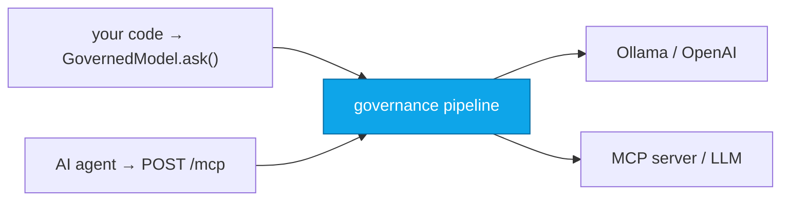

<!--
<p align="center">
  
</p>
-->

<p align="center">
  <strong>Install once, get governed AI.</strong><br>
  <em>PII redacted · Injections blocked · Loops broken · Actions audited · EU AI Act tracked</em>
</p>

<p align="center">
  <a href="https://pypi.org/project/admina-framework/"></a>
  &nbsp;<a href="https://github.com/admina-org/admina/blob/main/LICENSE"></a>
  &nbsp;
  &nbsp;
</p>

<p align="center">
  <a href="https://github.com/admina-org/admina/actions/workflows/ci.yml"></a>
  &nbsp;<a href="https://github.com/admina-org/admina/actions/workflows/release.yml"></a>
  &nbsp;<a href="https://github.com/admina-org/admina/actions/workflows/security.yml"></a>
  &nbsp;<a href="https://pypi.org/project/admina-framework/"></a>
</p>

<p align="center">
  <a href="https://deepwiki.com/admina-org/admina"></a>
  &nbsp;<a href="https://admina.org/docs"></a>
</p>

<p align="center">
  <a href="#quick-start"></a>
  &nbsp;<a href="#see-it-in-action"></a>
  &nbsp;<a href="https://admina.org/docs"></a>
  &nbsp;<a href="https://deepwiki.com/admina-org/admina"></a>
</p>

---

## See it in action

**Scaffold a project and boot the governed proxy + dashboard — no Docker:**

<p align="center">
  
</p>

**Wrap any model in a few lines — PII is stripped before the model ever sees it:**

<p align="center">
  
</p>

**The governance dashboard, before and after simulated traffic — Admina Score 40 → 60:**

<table>
  <tr>
    <td align="center" width="50%">
      <br>
      <em>First boot — Admina Score <strong>40/100</strong></em>
    </td>
    <td align="center" width="50%">
      <br>
      <em>After <code>python scripts/simulate.py</code> — <strong>60/100</strong></em>
    </td>
  </tr>
</table>

---

## Why Admina?

|                                | Plain LLM / RAG app                  | **With Admina**                                                          |
| :----------------------------- | :----------------------------------- | :----------------------------------------------------------------------- |
| PII in prompts/responses       | leaks unless you build redaction     | **Redacted by default** — email, SSN, IBAN, phone, IP, names             |
| Prompt injections              | reach the model                      | **Blocked at the proxy** — 15 regex + Rust heuristic scoring             |
| Agent tool calls               | unaudited                            | **Validated pre-action + logged post-action** (forensic chain)           |
| Loop / runaway agents          | burn tokens / budget                 | **Broken** — TF-IDF cosine similarity over the action stream             |
| EU AI Act readiness            | manual                               | **Gap analysis + risk classification** built-in                          |
| Audit trail                    | logs you hope nobody deletes         | **SHA-256 hash chain** — tamper-evident by design                        |
| Adding governance to existing code | rewrite the call sites           | **Zero code changes** via proxy, or 3 lines via SDK                      |
| Performance overhead           | unknown                              | **~6 µs per pipeline** (Rust engine), in-process or networked            |
| License                        | varies                               | **Apache 2.0**, open core                                                |

> Admina is **decision-support and defense-in-depth**, not legal advice. See [Compliance scope](#compliance-scope) for the full disclaimer and limitations.

---

## 30-second example

```python
from admina import GovernedModel, GovernedData, GovernedAgent, ComplianceKit
from admina.plugins.builtin.adapters.ollama import OllamaAdapter
from admina.plugins.builtin.connectors.chromadb import ChromaDBConnector

# Every call is governed: PII redacted, injections blocked, audited
adapter = OllamaAdapter(host="http://localhost:11434")
model = GovernedModel(model_name="llama3.1:8b", adapter=adapter)
response = await model.ask("Summarize this document")

# Data governance: residency enforcement, PII classification
connector = ChromaDBConnector(host="localhost", port=8000)
data = GovernedData(connector=connector, residency_zone="eu")
await data.ingest(documents)

# Agent governance: validate every tool call before execution
async def my_upstream(method, params, **kw): ...  # your MCP/HTTP client
agent = GovernedAgent(upstream=my_upstream)
result = await agent.call("tools/call", {"name": "read_file", "arguments": {}})

# Compliance: EU AI Act gap analysis and risk classification
kit = ComplianceKit()
report = kit.gap_analysis(risk_category="high", current_compliance={...})
```

## Quick Start

### Install from PyPI

```bash
# Recommended for new users: SDK + proxy + dashboard.
# Lets you run `admina dev` and see the dashboard out of the box.
pip install "admina-framework[proxy]"

# Everything (proxy + NLP + telemetry). Use this if you also want
# spaCy-based NER for PII detection or OpenTelemetry export.
pip install "admina-framework[full]"
python -m spacy download en_core_web_sm   # for [full] only

# Model-adapter provider SDKs (per-provider extras):
pip install "admina-framework[openai]"      # openai>=1.0
pip install "admina-framework[ollama]"      # ollama>=0.3
pip install "admina-framework[anthropic]"   # anthropic>=0.39
pip install "admina-framework[mistral]"     # mistralai>=1.0
pip install "admina-framework[gemini]"      # google-genai>=1.0
pip install "admina-framework[bedrock]"     # boto3>=1.34 (AWS Bedrock)

# All provider SDKs at once:
pip install "admina-framework[adapters]"

# Everything (proxy + NLP + telemetry + all adapters):
pip install "admina-framework[all]"
python -m spacy download en_core_web_sm   # for [all] only

# Optional: Rust-accelerated engine (auto-detected at runtime).
# Opt-in extra — pulls in the admina-core wheel from PyPI.
pip install "admina-framework[rust]"

# Advanced: SDK only (no proxy, no dashboard, no `admina dev`).
# Use this when embedding the SDK into another service and you don't
# need the local dev server.
pip install admina-framework
```

> The PyPI distribution name is `admina-framework`; the Python import
> name is `admina` (e.g. `from admina import GovernedModel`). This is
> a normal Python pattern — same as `python-dateutil` → `import dateutil`.

> The Rust engine is an **optional, opt-in** accelerator. The default
> `pip install admina-framework` ships only the pure-Python implementation;
> `admina-framework[rust]` adds the `admina-core` wheel, which Admina
> auto-detects at runtime (falling back to pure Python if it's absent).
>
> The default is pure Python on purpose: the Python injection firewall
> currently has **broader detection coverage** than the Rust one (it adds
> obfuscation-normalisation — homoglyph, leetspeak, base64, ROT13 — and a
> wider multilingual pattern set). Enable `[rust]` when per-request latency
> matters more than that extra coverage. See
> [Performance](#performance--hybrid-python--rust-engine) for the trade-off.

### Or install from source

```bash
git clone https://github.com/admina-org/admina.git
cd admina

# Recommended: proxy + dashboard + infra deps (enables `admina dev`)
pip install -e ".[proxy]"

# Everything (proxy + NLP + telemetry)
pip install -e ".[full]"

# All model-adapter SDKs
pip install -e ".[adapters]"

# Everything (proxy + NLP + telemetry + all adapters)
pip install -e ".[all]"

# CLI workflow
admina init my-project   # Scaffold a governed AI project
cd my-project            # admina dev runs from the project directory
admina dev               # Start the local proxy + dashboard

# Full stack via Docker (no [proxy] extra required)
./scripts/bootstrap-secrets.sh   # Auto-generate .env with random credentials
docker compose up --build        # Credentials printed at bootstrap

# Note: To use the OllamaAdapter, install Ollama (https://ollama.ai)
# and pull a model first: ollama pull llama3.1:8b

# Advanced: SDK only (no proxy, no dashboard)
pip install -e .
python -c "from admina import GovernedModel; print('SDK ready')"
```

Dashboard: [http://localhost:3000](http://localhost:3000) | API docs: [http://localhost:8080/docs](http://localhost:8080/docs)

## Architecture

Admina runs in **dual mode** — in-process via SDK or networked via proxy — but both modes feed the **same governance pipeline**.


```mermaid
flowchart LR
    A1["your code → GovernedModel.ask()"] --> P
    A2["AI agent → POST /mcp"] --> P
    P["governance pipeline"]
    P --> U1["Ollama / OpenAI"]
    P --> U2["MCP server / LLM"]
    classDef pipe fill:#0ea5e9,stroke:#0369a1,color:#fff;
    class P pipe;
```

Pipeline (identical in both modes): `loop-breaker → firewall → PII redaction → guards → audit → forensic chain (SHA-256) → OTEL`

## The 4 Governance Domains

| Domain | Capabilities | Engine |
|--------|-------------|--------|
| **Agent Security** | Anti-injection firewall (15 regex + heuristic scoring), loop breaker (TF-IDF cosine similarity) | Rust + Python |
| **Data Sovereignty** | PII redaction (email, SSN, credit cards, IBAN, phone, IP), residency enforcement, data classification | Rust + spaCy NER |
| **Compliance** | EU AI Act risk classification (Art. 6) and gap analysis (Art. 9-15), forensic black box (SHA-256 hash chain), OTEL native spans | Rust + Python |
| **AI Infrastructure** | LLM engine (Ollama, OpenAI), RAG pipeline (ChromaDB), Open WebUI | Python |

All governance domains operate **bidirectionally** — scanning both outbound requests and inbound responses.

## SDK

Four governed primitives, each with async + sync interfaces:

```python
from admina import GovernedModel, GovernedData, GovernedAgent, ComplianceKit
```

| Primitive | Purpose | Governance applied |
|-----------|---------|-------------------|
| `GovernedModel` | LLM calls (Ollama, OpenAI) | PII redaction on prompts and responses, event audit |
| `GovernedData` | Data ingestion and queries | PII classification, residency enforcement, access audit |
| `GovernedAgent` | MCP/A2A agent calls | Firewall, PII, loop breaker — full proxy pipeline in-process |
| `ComplianceKit` | Regulatory compliance | EU AI Act risk classification, gap analysis, report generation |

## Plugin System

9 plugin interfaces, auto-discovered from `plugins/builtin/` or installed via CLI:

| Interface | Builtin implementations |
|-----------|------------------------|
| Model Adapter | Ollama, OpenAI, Anthropic, Gemini, Mistral, Bedrock, vLLM |
| Data Connector | ChromaDB, Filesystem |
| Governance Domain | GuardrailsAI (toxic, jailbreak, bias, PII) |
| Compliance Template | EU AI Act |
| Transport Adapter | MCP, HTTP REST |
| Forensic Store | Filesystem, S3-compatible (boto3 — AWS S3, MinIO, R2, …) |
| Auth Provider | API Key |
| PII Engine | spaCy + Regex (default), Microsoft Presidio (`pip install admina-framework[presidio]`, `ADMINA_PII_ENGINE=presidio`) |
| Alert Channel | Log, Webhook |

Model adapters lazy-import their provider SDK, so install the ones you
use: `pip install admina-framework[adapters]` for all of them, or a
single provider (`[openai]`, `[ollama]`, `[anthropic]`, `[mistral]`,
`[gemini]`, `[bedrock]`). vLLM has no extra of its own — it serves an
OpenAI-compatible API and subclasses the OpenAI adapter, so install
`[openai]` for it.

```bash
admina plugin list                    # List registered plugins
admina plugin install ./my-plugin     # Install a custom plugin
admina plugin create my-domain        # Scaffold a new plugin
```

## CLI

```bash
admina init my-project     # Scaffold project with admina.yaml + docker-compose.yml
admina dev                 # Local mode: proxy + dashboard on :3000 (no Docker)
admina dev --stack         # Docker stack: + redis + clickhouse + grafana
admina dev --with-llm      # --stack + ollama + chromadb + open-webui
admina plugin list         # List all registered plugins
admina plugin install X    # Install a plugin from path or registry
admina plugin create X     # Scaffold a new plugin from template
```

`admina dev` defaults to a **single-process local mode** with zero Docker
dependency: one uvicorn serves the proxy API and the dashboard SPA on the
same port. Use `--stack` for the production-like Docker compose, or
`--with-llm` to also boot local LLM services.

## Dashboard

Real-time governance dashboard on port 3000:

- **Governance Score** — 0-100 composite metric (data residency, audit coverage, attack rate, forensic integrity, EU AI Act compliance)
- **Live Feed** — streaming governance events via WebSocket
- **Compliance Gaps** — EU AI Act gap analysis with article-level detail
- **Infrastructure Health** — proxy, Redis, forensic store, ClickHouse, OTEL status

API backend: `GET /api/dashboard/score`, `/feed`, `/compliance`, `/sovereignty`, `/infra`, `/models`

In `admina dev` local mode the dashboard asks for the API key (`admina password show`)
and keeps a short-lived browser session that only the read-only dashboard API accepts.
Set `ADMINA_DASHBOARD_ENABLED=false` to stop serving the bundled dashboard.

## Configuration

Admina uses `admina.yaml` as the primary config file (with `.env` fallback for backward compatibility):

```bash
cp admina.yaml.example admina.yaml   # Copy and customize
```

See [`admina.yaml.example`](https://github.com/admina-org/admina/blob/main/admina.yaml.example) for all options including domains, AI infra, plugins, dashboard, forensic storage, alert channels, and integrations.

Custom firewall rules (`agent_security.firewall.custom_patterns`) run on
Python's backtracking `re` engine. Check each one on long inputs before
deploying it:

```python
from admina.domains.agent_security.pattern_timing import measure_pattern, probe_pattern

probe_pattern(r"delete\s+user\s+\d+")    # worst search time in ms on 64k-character inputs
measure_pattern(r"delete\s+user\s+\d+")  # the same, with the slowest input and all timings
```

A result above 50 ms flags a pattern that is too slow on some long input. One
whitespace quantifier between two literals, with the whitespace inside each
optional group and possessive quantifiers (`\s++`, `\s*+`) where a whitespace
run is followed by a literal, keeps the backtracking over a whitespace run
linear in the length of the run.

That rule does not limit how many positions a search starts from. A pattern
that begins with a repeated character class can start at every position of a
long run of that class and read to the end of the run each time:
`\b[\w.]+=\d` passes the probe, yet takes time proportional to the square of
the run length on `a.a.a.…` (no `=`). The generated inputs contain no such
runs, so time them as well:

```python
import re
from admina.domains.agent_security.pattern_timing import search_ms

search_ms(re.compile(r"\b[\w.]+=\d"), "a." * 32768)   # ms on a 64k-character run
```

Anchoring the start of the run, `(?<![\w.])[\w.]++=\d`, gives one attempt per
run (a match then starts where the run starts).

### Request size limits

`ADMINA_MAX_REQUEST_BYTES` (default 10 MiB, `0` = no limit) caps the request
body on every route. A body over the cap gets 413 before it is parsed: at once
when its `Content-Length` is over the cap, otherwise as soon as the bytes read
go over it. The 413 body is in the OpenAI error format on `/v1`
(`invalid_request_error`, code `request_too_large`) and `{"detail": ...}`
elsewhere. `MAX_REQUEST_TOKENS` (default 100000, `0` = no limit) caps the
request content on `/mcp`, estimated as the length in characters of the
scanned text. `ADMINA_GATEWAY_MAX_PROMPT_CHARS` (default `0`, no limit) caps
the message text of `POST /v1/chat/completions`, in characters (the text of
every message, as scanned); longer requests get 413 (`invalid_request_error`,
code `prompt_too_long`) before any governance check.

### OpenAI-compatible gateway

The proxy serves an OpenAI-compatible API at `/v1` (`POST /v1/chat/completions`,
streaming and non-streaming, and `GET /v1/models`). It runs the governance
pipeline on each chat completion and forwards requests to an upstream route.
By default there is one route, `default`, to `ADMINA_GATEWAY_UPSTREAM`
(`http://localhost:11434/v1`), and no credentials are sent upstream.

Named routes come from `ADMINA_GATEWAY_UPSTREAMS` or from `gateway.upstreams`
in `admina.yaml`; the environment variable, when set, replaces the YAML routes
(URLs and key files):

```bash
ADMINA_GATEWAY_UPSTREAMS=main=http://main.upstream.test/v1,util=http://util.upstream.test/v1
ADMINA_GATEWAY_UPSTREAM_API_KEY_FILE=/run/secrets/upstream_api_key
```

```yaml
gateway:
  upstreams:
    main: { url: "http://main.upstream.test/v1", api_key_file: /run/secrets/upstream_api_key }
    util: { url: "http://util.upstream.test/v1", api_key_file: /run/secrets/upstream_api_key }
  default_upstream: main
```

A request picks a route with the `X-Admina-Upstream` header. Without it the
gateway uses `default_upstream`, or else the first route; an unknown route name
gets a 400 response in the OpenAI error format (`invalid_request_error`, code
`unknown_upstream`) and is neither scanned nor recorded. The route name is
stored in the forensic record (`upstream`).

The upstream receives `Authorization: Bearer <key>` when the route has a key.
The key of a route is the first one set, in this order:

| Source | Scope |
|---|---|
| `ADMINA_GATEWAY_UPSTREAM_<NAME>_API_KEY` or `…_API_KEY_FILE` (`<NAME>`: route name in upper case) | one route |
| `api_key_file` of the route in `admina.yaml` | one route |
| `ADMINA_GATEWAY_UPSTREAM_API_KEY` or `ADMINA_GATEWAY_UPSTREAM_API_KEY_FILE` | every route |

Key files are read once at startup and one trailing newline is removed. The
proxy does not start when a key file is missing, unreadable or empty, when a
key is set both directly and as a file, when a route is malformed or when
`default_upstream` names no route. Keys are masked in the settings
representation and are not logged. The caller's `Authorization`, `X-API-Key`,
`Cookie` and `X-Admina-Upstream` headers are not forwarded upstream.

#### Upstream responses, errors and timeouts

`ADMINA_GATEWAY_STREAM_MODE`, or `gateway.stream_mode` in `admina.yaml` (the
environment variable wins), sets how streamed chat completions are relayed:

| Mode | Behaviour |
|---|---|
| `passthrough` (default) | While no response transformation is active (`PII_REDACTION_ENABLED=false`), the client receives the upstream bytes unchanged, every field included, each SSE event as soon as it is complete. With PII redaction on, the gateway relays as in `governed`. |
| `governed` | Each SSE chunk is parsed and re-serialised, one chunk for each upstream chunk, with all of its fields. With PII redaction on, every string of a choice is redacted, per choice and per field across chunks: `content` (a string or a list of parts), reasoning text, tool and function call `arguments` and any other field; text held back to catch an entity split across chunks is sent with the choice's finish chunk, at the same place, or in a last chunk at the end of the stream. `data: [DONE]` is sent when the upstream sends it. |

A non-streaming response is forwarded unchanged unless PII redaction is on;
then the gateway parses it, and a successful response that is not a JSON
object gets 502 (code `upstream_invalid_response`). An upstream error (4xx,
5xx) reaches the client with its status, body and content type, streaming or
not.

With PII redaction on, in streamed and non-streaming completions alike:

- structural values are kept as they are: `index`, `id`, `type`, `role`,
  `name` and `finish_reason`, and the completion's `id`, `object`,
  `created`, `model`, `system_fingerprint` and `service_tier`;
- `logprobs` and `token_ids` of each choice are sent as `null`, since
  generated text split into tokens cannot be redacted token by token;
- other strings outside the choices, and SSE comment lines, are redacted as
  whole values;
- values nested more than 16 levels deep are dropped.

The gateway talks to its upstreams through a client of its own:

| Setting | Default | Meaning |
|---|---|---|
| `ADMINA_GATEWAY_TIMEOUT_CONNECT` | `30` | seconds to open a connection or get a free one from the pool |
| `ADMINA_GATEWAY_TIMEOUT_READ` | `30` | seconds to wait for the next upstream bytes (and for each write of the request) |
| `ADMINA_GATEWAY_TIMEOUT_TOTAL` | `0` | seconds for the whole upstream exchange, from the request to the last byte |
| `ADMINA_GATEWAY_MAX_CONNECTIONS` | `100` | size of the connection pool |
| `ADMINA_GATEWAY_MAX_KEEPALIVE_CONNECTIONS` | `20` | idle connections kept open |

A timeout of `0` means no limit. A timeout before the response starts gets
504, any other connection failure 502, both with an OpenAI-style body
(`{"error": {"message", "type": "upstream_error", "param", "code"}}`, code
`upstream_timeout` or `upstream_error`). A failure during a stream ends it
with one `data: {"error": {...}}` event and no `data: [DONE]`. When the client
disconnects, the gateway closes the upstream request.

#### Governance pipeline threads and time budget

The gateway runs the governance pipeline (firewall, PII redaction, egress
analysis, governance guards) and the PII redaction of completions in a pool of
worker threads, so that scanning one request does not hold up the others:

| Setting | Default | Meaning |
|---|---|---|
| `ADMINA_GATEWAY_PIPELINE_WORKERS` | `0` | threads in the pool, the most requests governed at once (`0` = the number of CPUs); further requests wait for a free thread |
| `ADMINA_GATEWAY_PIPELINE_TIMEOUT` | `0` | seconds a request waits for its governance decision, the wait for a free thread included (`0` = no limit) |

A request whose decision takes longer than `ADMINA_GATEWAY_PIPELINE_TIMEOUT` is
blocked, in every governance mode, and never forwarded; its forensic record has
`checks.pipeline = {"action": "BLOCK", "reason": "time_budget_exceeded",
"budget_ms": <budget>}`. The thread that was scanning it stays busy until the
scan ends. A request whose pipeline raises (in the firewall, PII redaction,
egress analysis or a guard) is blocked the same way, in every governance mode,
since its checks may not have run; the record has `checks.pipeline =
{"action": "ERROR", "error": "<exception class>"}`. A guard contract error
(`ValueError`, `RuntimeError`, `OSError` or `TypeError` from a guard) is
handled inside the pipeline and follows `ADMINA_GUARD_FAIL_MODE`, as on the
other surfaces.

With PII redaction on, the redaction of each completion, and of each line of
a stream, runs in the worker threads within the same time budget. A
non-streaming completion whose redaction runs over the budget or raises is
replaced by the block message (`finish_reason: "content_filter"`); a stream
whose redaction runs over the budget or raises ends with one
`data: {"error": {...}}` event (code `response_redaction_failed`) and no
`data: [DONE]`. The text of that completion or line is not sent.
Governance guards run in the worker threads too, each thread with an event loop
of its own.

With `ADMINA_GATEWAY_SCAN_RESPONSE=true` (default `false`) the firewall also
checks the completion text, the `content` of each choice, in the same worker
threads and time budget (and only while `INJECTION_FAST_PATH_ENABLED` is on):

- a non-streaming completion is checked before it is returned; when it is
  flagged in `enforce` mode, or its check runs over the time budget, the client
  receives the block message instead (`finish_reason: "content_filter"`);
- a streamed completion is checked after the last event has been sent: the
  text has already reached the client, so the outcome is only recorded.

Each check writes a forensic record of its own, `event_type:
"gateway_response_scan"`, with `request_event_id` (the `event_id` of the
request record), `stream`, `action` (`BLOCK` or `ALLOW`), `risk_level`,
`would_action: "BLOCK"` when flagged but not blocked (a stream, or `observe`
mode) and `checks.response_firewall` (names and signals, no text). Upstream
errors and responses that are not a JSON object are not checked.

`/metrics` serves `admina_event_loop_lag_seconds`, a histogram of how late the
proxy's event loop wakes up a task that sleeps 0.1 s at a time (buckets from
1 ms to 5 s, with `_sum` and `_count`): the time the loop spent on other work
before it could run it. It stays around a millisecond while nothing holds up
the loop.

#### Firewall ruleset

`ruleset_sha256()` (`admina.domains.agent_security.ruleset`) names the firewall
rules a configuration applies: the SHA-256, as 64 lowercase hex characters, of
the RFC 8785 (JCS) serialisation of the Admina version, the engine, the active
builtin patterns (Python engine) or the `admina-core` version (Rust engine),
`pattern_packs`, `custom_patterns`, `disabled_categories` and
`heuristic_threshold` in thousandths. The exact form is in the module
docstring. The SDK can compute it from `admina.yaml` without the proxy:

```python
from admina.core.config import load_config
from admina.domains.agent_security.ruleset import ruleset_sha256

ruleset_sha256(load_config("admina.yaml"))                 # Python engine
ruleset_sha256(load_config("admina.yaml"), engine="rust")  # Rust engine
```

The proxy computes it at startup for the engine its firewall runs on. Every
`POST /v1/chat/completions` response carries it in `X-Admina-Ruleset` (allowed,
blocked and error responses), and `GET /v1/admina/ruleset` (API key required)
returns:

```json
{
  "ruleset_sha256": "<64 hex>",
  "engine": "python",
  "admina_core_version": null,
  "admina_version": "<version>",
  "accepted_prescan_rulesets": ["<64 hex>"],
  "prescan_tags": [],
  "scan_roles": ["system", "user", "assistant", "tool"],
  "scan_policy_enabled": false
}
```

#### Scan scope

The firewall of the gateway scans the messages whose role is in
`ADMINA_GATEWAY_SCAN_ROLES` (comma-separated, among `system`, `user`,
`assistant` and `tool`; default all four). Messages with any other role, or
none, are always scanned. The scan scope applies to the firewall only: PII
redaction and governance guards still see every message.

A caller that has already scanned part of a prompt, for example retrieved
documents scanned with the SDK, can narrow the scan of one request with the
`X-Admina-Scan-Policy` header, once the operator has turned scan policies on
with `ADMINA_GATEWAY_SCAN_POLICY_ENABLED=true` (default `false`: the header is
ignored and every request is scanned in full):

```
X-Admina-Scan-Policy: v1; roles=user,tool; prescanned=source,document; ruleset=<sha256>
```

| Field | Meaning |
|---|---|
| `v1` | format version (required, first) |
| `roles` | scan only these of the configured roles (optional) |
| `prescanned` | skip the text of `<tag …>…</tag>` blocks of these tags (optional); only tags listed in `gateway.prescan_tags` of `admina.yaml` are skipped |
| `ruleset` | `ruleset_sha256()` of the rules the caller scanned with (required) |

The policy applies only when `ruleset` is the proxy's own ruleset or one listed
in `gateway.prescan_rulesets`:

```yaml
gateway:
  prescan_tags: [source, document]
  prescan_rulesets: ["<sha256 of the caller's rules>"]
```

Otherwise, or when the header is malformed (unknown version or field, duplicate
field, unknown role, invalid tag name or ruleset, more than one header), the
request is scanned in full, never refused. A block is skipped only when each
of its tags pairs up (an opening tag followed by its closing tag); an unclosed,
nested or stray tag leaves the whole text to the scan. Tag names are
case-sensitive. The caller must keep these tags out of text written by
untrusted parties, because the gateway cannot tell such text from its own
blocks.

Trust model: with scan policies on, the gateway takes the caller's word for
what it has scanned. Any caller that holds the API key can send the header,
and the ruleset it must declare is not a secret (it is on every response and
on `GET /v1/admina/ruleset`), so such a caller can narrow the scan of its own
requests down to leaving out every user message. Turn scan policies on only
when every caller that can reach the gateway is a trusted component that
scans the text it declares, for example a service in front of the gateway
that scans retrieved documents with the SDK and passes on its users' text as
`user` messages.

The `gateway_request` forensic record carries the outcome:

```json
"prescan": {"accepted": true, "status": "accepted", "roles": ["user", "tool"],
            "tags": ["document", "source"], "ruleset": "<sha256>"}
```

`status` is `none` (no header), `accepted`, `ruleset_mismatch`, `malformed` or
`ignored` (scan policies off); `roles` and `tags` are what was applied,
`ruleset` what the header declared (`null` when it was ignored). `/metrics`
counts the policies: `admina_prescan_accepted_total`,
`admina_prescan_ruleset_mismatch_total`, `admina_prescan_malformed_total` and
`admina_prescan_ignored_total`.

<a id="compliance-scope"></a>

<details open>
<summary><strong>⚖️ Compliance scope &amp; legal disclaimer</strong> — what Admina does and does not do legally</summary>

<br>

> Admina is a self-assessment and defense-in-depth tool. The EU AI Act
> gap-analysis and risk classification features are **decision-support
> aids, not legal advice**. They do not replace the conformity assessment
> required under EU AI Act Art. 43 for high-risk systems, nor the
> involvement of a notified body where the regulation requires one.
>
> **EU AI Act timeline (after the Omnibus VII agreement of 7 May 2026):**
> Art. 5 prohibitions in force since 2 February 2025; GPAI obligations
> in force since 2 August 2025; Art. 50 transparency for synthetic
> content and the new NCII / synthetic-CSAM prohibition apply from
> 2 December 2026; **Annex III high-risk obligations from 2 December
> 2027** (postponed from 2 Aug 2026); Annex I high-risk from 2 August
> 2028 (postponed from 2 Aug 2027). The full machine-readable timeline
> ships with Admina as `admina.domains.compliance.eu_ai_act.EU_AI_ACT_DEADLINES`.
> See [`MODEL_CARD.md`](https://github.com/admina-org/admina/blob/main/MODEL_CARD.md) for the full scope, limitations,
> and known failure modes of every Admina component.

</details>

## Integrations

<details>
<summary><strong>GuardrailsAI</strong> — ML-based content validation as a governance plugin</summary>

<br>

ML-based content validation (toxic language, jailbreak, bias, PII via Presidio) as a governance domain plugin:

```bash
# Upstream guardrails-ai is currently in PyPI quarantine. Install it
# manually from your local mirror or wheel cache; once available, the
# plugin in admina/plugins/builtin/guards/guardrailsai_guard.py will
# detect it automatically.
pip install <your-guardrails-ai-wheel>
```

Enable in `admina.yaml` under `agent_security.domains.guardrailsai`. All inference runs locally by default — no data leaves the deployment perimeter.

</details>

<details>
<summary><strong>OpenClaw</strong> — govern OpenClaw agent actions via pre/post-action hooks</summary>

<br>

Govern OpenClaw agent actions through the Admina proxy. Every tool call, shell command, and API request is validated before execution:

```bash
cd integrations/openclaw/admina-governance
chmod +x setup.sh && ./setup.sh
```

The skill uses `POST /api/v1/validate` (pre-action) and `POST /api/v1/audit` (post-action) endpoints.

</details>

<details>
<summary><strong>n8n</strong> — community nodes for n8n workflow automation</summary>

<br>

| Node | Purpose |
|------|---------|
| **Admina Govern** | Inline governance check — validates workflow data, blocks injections, redacts PII |
| **Admina Audit** | Logs workflow events to forensic black box with EU AI Act risk classification |
| **Admina Dashboard** | Trigger node — fires on governance events via WebSocket |

Install: `npm install n8n-nodes-admina` in your n8n instance.

</details>

<details>
<summary><strong>Cheshire Cat AI</strong> — govern all Cheshire Cat interactions via Python hooks</summary>

<br>

Three Python hooks (`agent_fast_reply`, `before_cat_sends_message`, `before_cat_recalls_memories`):

```bash
cd integrations/cheshirecat/admina-plugin
./setup.sh    # Start Admina sidecar
# Copy plugin into Cheshire Cat plugins/ directory
```

</details>

<details>
<summary><strong>LangChain</strong> — drop-in callback handler</summary>

<br>

Governs every LLM call and tool invocation in-process:

```python
from admina.integrations.langchain.callbacks import AdminaCallbackHandler

handler = AdminaCallbackHandler()
llm = ChatOpenAI(callbacks=[handler])
```

</details>

<details>
<summary><strong>CrewAI</strong> — step and task callbacks for multi-agent governance</summary>

<br>

```python
from admina.integrations.crewai.callbacks import admina_step_callback, admina_task_callback

agent = Agent(role="Researcher", step_callback=admina_step_callback)
crew = Crew(agents=[agent], tasks=[task], task_callback=admina_task_callback)
```

</details>

See [full integration docs](https://github.com/admina-org/admina/blob/main/docs/guides/integrations.md) for details.

## Performance — Hybrid Python + Rust engine

The Rust core engine is an optional accelerator. The default
`pip install admina-framework` ships only the pure-Python implementation;
enable the Rust engine with the opt-in extra `pip install
"admina-framework[rust]"` (or build from source for local development —
`maturin develop --release --manifest-path core-rust/Cargo.toml`, see
[CONTRIBUTING.md](https://github.com/admina-org/admina/blob/main/CONTRIBUTING.md)). At runtime Admina auto-detects
whichever is available and falls back transparently to Python if the Rust
extension is not installed.

> **Detection trade-off (why Rust is opt-in, not the default).** The Rust
> firewall is faster but currently detects a narrower set of attacks than
> the pure-Python firewall. The Python engine normalises common evasions
> before matching (homoglyph, leetspeak, char-by-char hyphenation, base64,
> ROT13) and carries a wider multilingual pattern set; the Rust engine does
> not yet. On an internal 14-attack evasion corpus the Python firewall
> blocks all 14 while the Rust firewall blocks 7 (the plain-text and
> multilingual-keyword attacks), with no false positives on either side.
> Full Rust↔Python detection parity is tracked for 0.10. Until then, keep
> the default (pure Python) when detection breadth matters; opt into
> `[rust]` when latency dominates.

Measured numbers below assume the Rust engine is loaded:

```
Component          Rust (median)   P95        P99
-----------------  -------------   ---------  ---------
Firewall (regex)   2.08us          2.33us     2.50us
PII Scanner        0.62us          0.67us     0.71us
Loop Breaker       2.38us          2.67us     2.75us
Hash Chain         1.00us          1.12us     1.25us
-----------------  -------------   ---------  ---------
4-Domain pipeline  6.25us          7.04us     7.29us
```

<details>
<summary>Rust vs Python comparison (click to expand)</summary>

```
Component          Python (median)   Rust (median)   Speedup
-----------------  ---------------   -------------   --------
Firewall           7.79us            2.08us          3.7x
PII (regex-only)   8.21us            0.62us          13.2x
PII (with spaCy)   1 992us           0.62us          3 213x
Loop (sklearn)     505us             2.38us          212x
-----------------  ---------------   -------------   --------
Full pipeline      2 261us           5.21us          434x
```

</details>

`scripts/bench_gateway.py` measures the latency the OpenAI-compatible gateway
adds on a retrieval-augmented trace, in one process: a mock upstream streaming
1000 chunks 5 ms apart, and a prompt with 12 `<source>` blocks of generated
prose (about 44,000 characters). It reports the time to the first chunk,
direct and through the gateway with and without `X-Admina-Scan-Policy`, at 1
and 8 concurrent requests, and the event loop lag with 8 clients streaming,
for each firewall engine:

```bash
.venv/bin/python scripts/bench_gateway.py --engines python,rust --json bench.json
```

## Traffic Simulator

Generate realistic governance traffic to test and demo the platform:

```bash
# Start the proxy
docker compose up -d

# Default: 60s at 2 req/s
python scripts/simulate.py

# Intense: 5 minutes at 10 req/s
python scripts/simulate.py --duration 300 --rate 10
```

Generates a weighted mix of: clean MCP requests, injection attempts, PII content, loop triggers, REST validate/audit calls, EU AI Act classifications, and dashboard reads. Colored terminal output with per-event action and summary counters.

## Infrastructure & Services

The full stack (`docker compose up`) runs 9 containers:

| Port | Service | Description |
|------|---------|-------------|
| `8080` | Proxy | MCP proxy + REST API + OpenAPI docs |
| `3000` | Dashboard | Real-time governance web UI |
| `3001` | Grafana | Metrics dashboards |
| `4317` | OTEL Collector | OTLP gRPC ingestion |

ClickHouse and Redis are internal only (not exposed to host).

<details>
<summary><strong>🗄️ Forensic backends (4 options) — choose deliberately</strong></summary>

<br>

The forensic blackbox (the SHA-256 hash chain that makes the audit trail
tamper-evident) supports three backends. Read this before picking one for
production.

| Backend | License | When to use | Caveats |
|---------|---------|-------------|---------|
| **`memory`** *(default)* | n/a | Local development, tests, demos | Records are LOST on restart — no audit persistence. Loud warning at startup. |
| **`filesystem`** | n/a | Single-host on-prem, air-gapped, smaller deployments | Persistence depends on the host filesystem; not ideal for HA. Requires `FORENSIC_BASE_DIR`. |
| **`s3`** *(boto3)* | Apache 2.0 (boto3) | Production / HA / multi-region | Works with **any S3-compatible service** — AWS S3, **MinIO** servers, Cloudflare R2, Backblaze B2, **SeaweedFS** (Apache 2.0), **Garage** (AGPLv3), **Ceph RGW** (LGPLv2). Supports WORM Object Lock. |

> **Using MinIO?** Point the `s3` backend at your MinIO server via
> `FORENSIC_S3_ENDPOINT` — MinIO speaks the S3 API, so no MinIO-specific
> client is needed. The legacy `minio`-SDK backend was removed in 0.9.5
> (the MinIO Python SDK is archived); `FORENSIC_BACKEND=minio` now
> transparently routes to the `s3` backend with a migration warning.

</details>

<details>
<summary><strong>⚙️ Environment variables (Docker / .env)</strong></summary>

<br>

| Variable | Default | Description |
|----------|---------|-------------|
| `ADMINA_API_KEY` | *(empty)* | API key for all endpoints |
| `UPSTREAM_MCP_URL` | `http://localhost:9000` | Default upstream MCP server |
| `REDIS_URL` | `redis://localhost:6379/0` | Session state + rate limiting |
| `FORENSIC_BACKEND` | `memory` | Forensic store: `memory` \| `filesystem` \| `s3` |
| `LOG_LEVEL` | `INFO` | Logging verbosity |

</details>

<details>
<summary><strong>📁 Full project structure</strong></summary>

<br>

```
admina/
+-- admina/                 SDK package (GovernedModel, GovernedData, GovernedAgent, ComplianceKit)
|   +-- plugins/            Plugin base classes + registry
+-- domains/                4 governance domains
|   +-- data_sovereignty/   PII, residency, classification
|   +-- ai_infra/           LLM engine, RAG pipeline, Web UI
|   +-- agent_security/     Firewall, loop breaker, proxy
|   +-- compliance/         EU AI Act, forensic, OTEL
+-- plugins/builtin/        Reference plugin implementations
|   +-- adapters/           Ollama, OpenAI
|   +-- connectors/         ChromaDB, Filesystem
|   +-- domains/            GuardrailsAI
|   +-- compliance/         EU AI Act template
|   +-- transports/         MCP, HTTP REST
|   +-- forensic/           Filesystem
|   +-- auth/               API Key
|   +-- pii/                spaCy + Regex
|   +-- alerts/             Log, Webhook
+-- proxy/                  FastAPI proxy + Rust engine bridge
|   +-- api/                Dashboard + integration REST endpoints
+-- cli/                    CLI commands (init, dev, plugin)
+-- core/                   Config, types, event bus
+-- core-rust/              Rust governance engines (PyO3)
+-- dashboard/              Real-time governance web UI
+-- integrations/
|   +-- openclaw/           OpenClaw governance skill
|   +-- n8n/                n8n community nodes
+-- tests/                  800+ tests (pytest)
+-- docker-compose.yml      Full stack deployment (9 containers)
```

</details>

<details>
<summary><strong>🔌 API examples (curl)</strong></summary>

<br>

```bash
# Health check (always public)
curl http://localhost:8080/health

# Governance stats
curl http://localhost:8080/api/stats -H "X-API-Key: $ADMINA_API_KEY"

# Proxy an MCP call (all governance domains applied)
curl -X POST http://localhost:8080/mcp \
  -H "Content-Type: application/json" \
  -d '{"jsonrpc":"2.0","id":1,"method":"tools/call","params":{...}}'

# Validate content (REST API for integrations)
curl -X POST http://localhost:8080/api/v1/validate \
  -H "Content-Type: application/json" \
  -d '{"content": "Check this text for governance issues"}'

# Audit an action (forensic logging)
curl -X POST http://localhost:8080/api/v1/audit \
  -H "Content-Type: application/json" \
  -d '{"event": {"action": "llm_call", "status": "success"}}'

# EU AI Act risk classification
curl -X POST http://localhost:8080/api/compliance/classify \
  -H "Content-Type: application/json" \
  -d '{"description":"AI credit scoring","use_case":"lending","data_types":["financial"]}'

# Dashboard governance score
curl http://localhost:8080/api/dashboard/score
```

</details>

## Project documents

- [CONTRIBUTING.md](https://github.com/admina-org/admina/blob/main/CONTRIBUTING.md) — development setup, testing, and pull request workflow
- [MODEL_CARD.md](https://github.com/admina-org/admina/blob/main/MODEL_CARD.md) — transparency artifact for every Admina governance component (intended use, scope, limitations, known failure modes), aligned with EU AI Act Art. 13 and NIST AI RMF
- [ROADMAP.md](https://github.com/admina-org/admina/blob/main/ROADMAP.md) — planned milestones from 0.9.x to 1.0 and beyond
- [CHANGELOG.md](https://github.com/admina-org/admina/blob/main/CHANGELOG.md) — release notes
- [SECURITY.md](https://github.com/admina-org/admina/blob/main/SECURITY.md) — coordinated disclosure policy
- [CODE_OF_CONDUCT.md](https://github.com/admina-org/admina/blob/main/CODE_OF_CONDUCT.md) — Contributor Covenant 2.1
- **Browse the AI-generated wiki** → [deepwiki.com/admina-org/admina](https://deepwiki.com/admina-org/admina)

Admina is Apache 2.0. Contributions are welcome.

## License

Copyright © 2025–2026 [Stefano Noferi](https://github.com/stefanoferi) & Admina contributors

Licensed under the Apache License, Version 2.0. See [LICENSE](https://github.com/admina-org/admina/blob/main/LICENSE) for the full text.

---

<p align="center">
  <br/>
  <em>Heimdall — the Governance Owl</em><br/><br/>
  <strong>admina.org</strong> · Created by Stefano Noferi · Pisa, Italy
</p>
