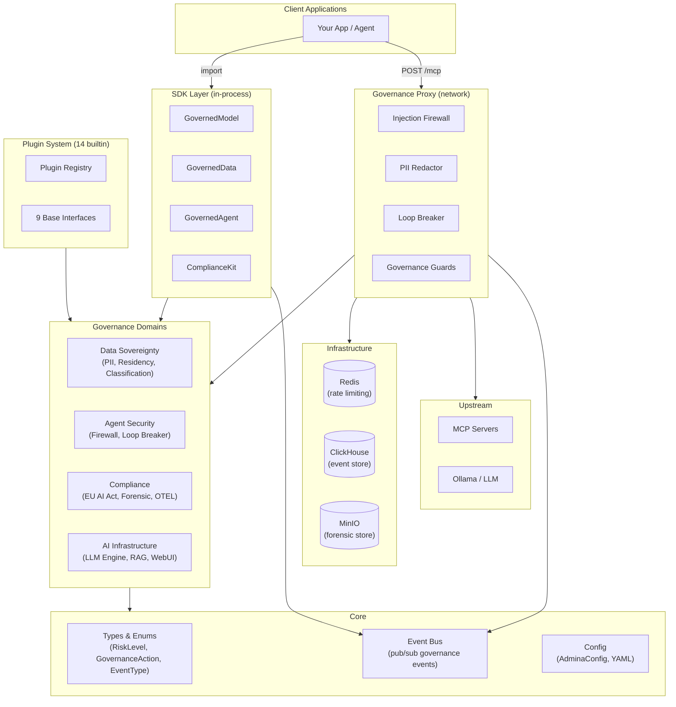
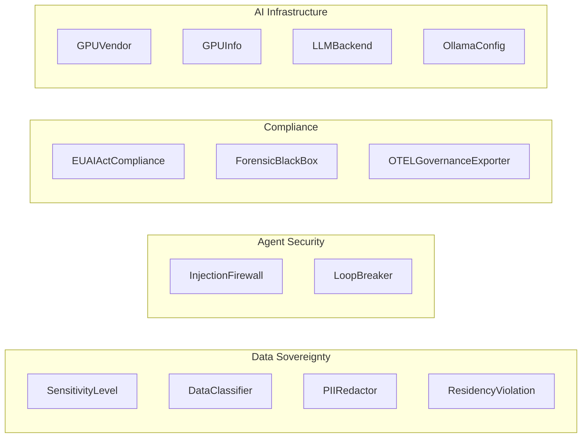
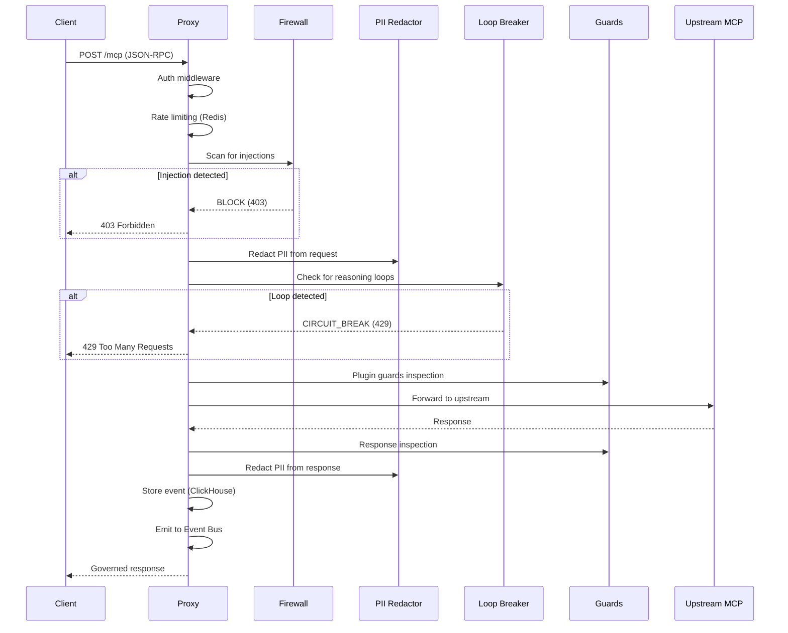
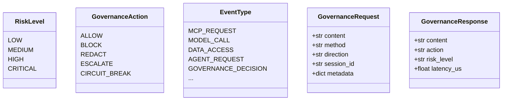

# Architecture

Admina is organized into layers: **SDK** (in-process), **Proxy** (network),
**Governance Domains**, **Plugin System**, and **Core** types/events.

## System Overview

## Layer Details

### SDK (6 classes)

The SDK provides in-process governance primitives:

| Class | Purpose |
|-------|---------|
| `GovernedModel` | Governed LLM inference with PII redaction |
| `GovernedData` | Governed data access with residency zones |
| `GovernedAgent` | Governed agent-to-agent MCP calls |
| `ComplianceKit` | EU AI Act risk classification & gap analysis |

### Governance Domains

### Plugin System

9 extensible plugin interfaces with 14 builtin implementations:

| Interface | Builtin |
|-----------|---------|
| `BaseModelAdapter` | OllamaAdapter, OpenAIAdapter |
| `BaseDataConnector` | ChromaDBConnector, FilesystemConnector |
| `BaseGovernanceGuard` | GuardrailsAIGuard |
| `BaseTransportAdapter` | MCPTransport, HTTPRESTTransport |
| `BaseForensicStore` | MinIOForensicStore, FilesystemForensicStore |
| `BaseAuthProvider` | APIKeyAuthProvider |
| `BasePIIEngine` | SpaCyRegexPIIEngine |
| `BaseAlertChannel` | LogAlertChannel, WebhookAlertChannel |
| `BaseComplianceTemplate` | EUAIActTemplate |

### Proxy Pipeline

### Proxy Modules

| Module | Purpose |
|--------|---------|
    | `config` | Proxy component |
| `engine_bridge` | Proxy component |
| `main` | Proxy component |
| `multi_upstream` | Proxy component |

### Core Types

