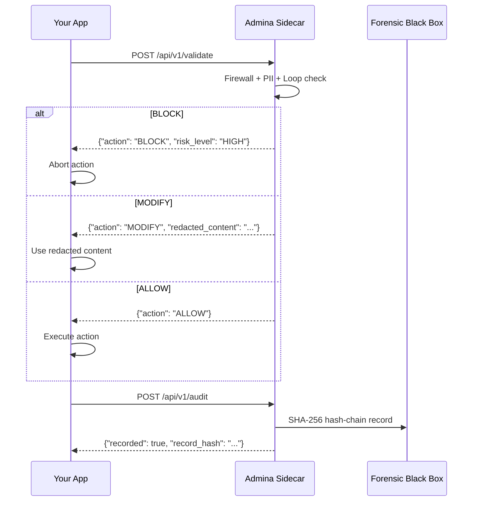
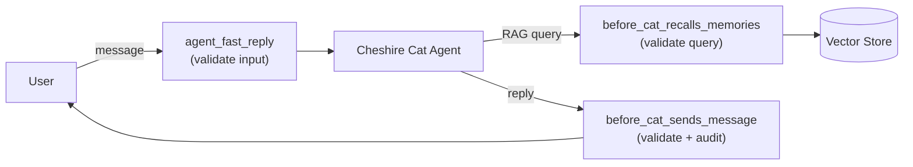
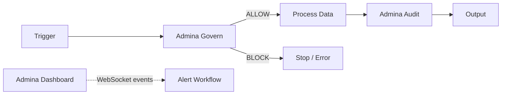

# Integrations

Admina integrates with external AI frameworks via a common REST API.
Each integration connects as a **sidecar**: a lightweight Docker container
running the Admina proxy alongside your application.

## How Integrations Work

All integrations share the same three-step governance flow:



## REST API Reference

### POST /api/v1/validate

Validate content through the governance pipeline before execution.

**Request:**
```json
{
  "content": "User message or action payload",
  "session_id": "optional-session-id"
}
```

**Response:**
```json
{
  "action": "ALLOW | BLOCK | MODIFY",
  "risk_level": "LOW | MEDIUM | HIGH | CRITICAL",
  "checks": {
    "loop_breaker": {"is_loop": false, "similarity": 0.12},
    "firewall": {"is_injection": false, "risk_level": "LOW"},
    "pii_redaction": {"count": 0, "entities": []}
  },
  "redacted_content": null,
  "latency_ms": 2.5
}
```

### POST /api/v1/audit

Log an event to the forensic black box (SHA-256 hash chain).

**Request:**
```json
{
  "event": {
    "action": "llm_call | shell_exec | cat_reply | ...",
    "input": "What triggered this action",
    "output": "What was produced",
    "status": "success | blocked | error",
    "session_id": "session-id"
  }
}
```

**Response:**
```json
{
  "recorded": true,
  "sequence_number": 42,
  "record_hash": "a1b2c3...",
  "previous_hash": "d4e5f6..."
}
```

---

## Available Integrations

### Cheshire Cat AI

Govern all Cheshire Cat interactions via three Python hooks:

| Hook | When | What |
|------|------|------|
| `agent_fast_reply` | Before the agent processes a message | Blocks injections, redacts PII in user input |
| `before_cat_sends_message` | Before the reply reaches the user | Redacts PII from response, audits interaction |
| `before_cat_recalls_memories` | Before the RAG query hits the vector store | Blocks injection via retrieval |



**Install:**

```bash
# 1. Start Admina sidecar
cd integrations/cheshirecat/admina-plugin
./setup.sh

# 2. Copy plugin into Cheshire Cat
cp -r admina-plugin/ <cheshire-cat>/plugins/admina-plugin/

# 3. Set environment variable
export ADMINA_PROXY_URL=http://localhost:18790

# 4. Activate from the Cat admin panel
```

**Behavior when proxy is unreachable:** Fails open — messages pass through
without governance, with a warning logged.

[Full README](https://github.com/admina-org/admina/tree/main/integrations/cheshirecat/admina-plugin)

---

### OpenClaw

Govern all OpenClaw agent actions via the validate/audit API.

| Step | Endpoint | Purpose |
|------|----------|---------|
| 1. Pre-action | `POST /api/v1/validate` | Check action before execution |
| 2. Execute | _(agent runs)_ | Only if validate returns ALLOW |
| 3. Post-action | `POST /api/v1/audit` | Log result to forensic black box |

**Supported action types:** `llm_call`, `shell_exec`, `file_write`, `http_request`, `message_send`

**Install:**

```bash
cd integrations/openclaw/admina-governance
./setup.sh
export ADMINA_PROXY_URL=http://localhost:18790
```

**Behavior when proxy is unreachable:** Agent must STOP.
No ungoverned actions are permitted.

[Full SKILL.md](https://github.com/admina-org/admina/tree/main/integrations/openclaw/admina-governance)

---

### n8n

Three n8n community nodes for workflow governance:

| Node | Type | Purpose |
|------|------|---------|
| **Admina Govern** | Transform | Validates workflow data inline — blocks or redacts |
| **Admina Audit** | Output | Logs workflow events to forensic black box |
| **Admina Dashboard** | Trigger | WebSocket listener for governance events |



**Install:**

```bash
# In your n8n instance
npm install n8n-nodes-admina
```

Then configure the **Admina API** credential with your proxy URL and optional API key.

[Full README](https://github.com/admina-org/admina/tree/main/integrations/n8n/n8n-nodes-admina)

---

### LangChain

Drop-in governance for any LangChain application via a callback handler.
Works **in-process** — no sidecar needed.

| LangChain Event | Admina Check |
|----------------|--------------|
| `on_llm_start` | Firewall + PII + Loop detection on prompt |
| `on_llm_end` | PII redaction on response |
| `on_tool_start` | Firewall + PII on tool input |
| `on_tool_end` | PII redaction on tool output |

**Usage:**

```python
from langchain_openai import ChatOpenAI
from admina.integrations.langchain.callbacks import AdminaCallbackHandler

handler = AdminaCallbackHandler()
llm = ChatOpenAI(callbacks=[handler])
response = llm.invoke("Summarize this document")

# Check governance
print(handler.last_result)   # GovernanceResult(action="ALLOW", ...)
print(handler.get_stats())   # {"call_count": 1, "block_count": 0, ...}
```

Blocked requests raise `GovernanceBlockedError` (set `on_block="warn"` to log instead).

[Full README](https://github.com/admina-org/admina/tree/main/integrations/langchain)

---

### CrewAI

Govern every CrewAI agent step via `step_callback` and `task_callback`.
Works **in-process** — no sidecar needed.

| Callback | When | Checks |
|----------|------|--------|
| `AdminaStepCallback` | After each agent step | Firewall + PII + Loop detection |
| `AdminaTaskCallback` | After each task completes | PII redaction on output |

**Usage:**

```python
from crewai import Agent, Task, Crew
from admina.integrations.crewai.callbacks import admina_step_callback, admina_task_callback

agent = Agent(
    role="Researcher",
    goal="Analyze trends",
    step_callback=admina_step_callback,
)
crew = Crew(agents=[agent], tasks=[task], task_callback=admina_task_callback)
crew.kickoff()
```

Multi-agent crews: each agent can have its own `AdminaStepCallback` with independent session and config.

[Full README](https://github.com/admina-org/admina/tree/main/integrations/crewai)

---

## Building Your Own Integration

Any application that can make HTTP calls can integrate with Admina.
The pattern is always the same:

1. **Start the sidecar** — `docker run ghcr.io/admina-org/admina:latest`
2. **Validate before acting** — `POST /api/v1/validate`
3. **Audit after acting** — `POST /api/v1/audit`

See the [Integration API source](https://github.com/admina-org/admina/blob/main/proxy/api/integration.py)
for the full endpoint implementation.

### Configuration

Each sidecar uses an `admina.yaml` config file. Key settings:

```yaml
agent_security:
  firewall:
    enabled: true
    sensitivity: high          # low | medium | high
  loop_breaker:
    enabled: true
    window_size: 8             # messages to track
    similarity_threshold: 0.85 # cosine similarity for loop detection
  pii_redaction:
    enabled: true
    entities: [EMAIL, PHONE, SSN, CREDIT_CARD, IBAN, IP_ADDRESS]

compliance:
  eu_ai_act:
    enabled: true
    risk_category: limited     # minimal | limited | high | unacceptable

forensic:
  enabled: true
  store: filesystem            # filesystem | minio
```
